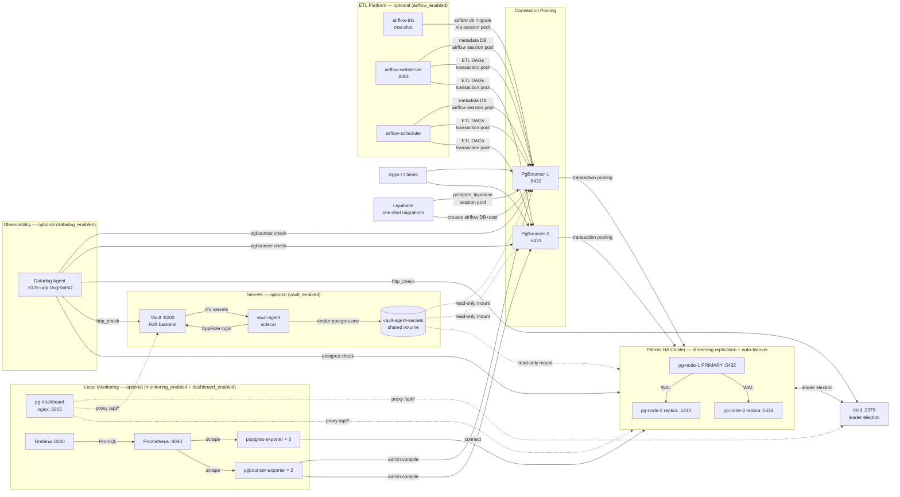

# CLAUDE.md

This file provides guidance to Claude Code (claude.ai/code) when working with code in this repository.

## Project Purpose

Production-ready **PostgreSQL 18 High Availability cluster** managed entirely with Terraform + Docker. The stack includes:
- 3-node Patroni cluster (1 primary + 2 replicas) with automatic failover via etcd
- PgBouncer connection pooling (transaction mode, 2 instances)
- Liquibase schema migrations (HA-aware, waits for primary before running)
- Vault secrets management (optional, toggle via `vault_enabled`)
- pgvector extension for AI/ML embeddings (1536-dim IVFFLAT)
- Datadog Agent for metrics, logs, and integration checks (optional, toggle via `datadog_enabled`)
- Prometheus + Grafana + exporter sidecars for local metrics dashboards (optional, toggle via `monitoring_enabled`)
- nginx status dashboard for live cluster overview (optional, toggle via `dashboard_enabled`)
- **Apache Airflow 2.x ETL platform** (optional, toggle via `airflow_enabled`) — connects to PostgreSQL HA via PgBouncer, stores metadata in a dedicated `airflow` DB, ships with example DAGs

## Repo Setup (one-time per clone)

```bash
bash scripts/install-hooks.sh   # enables .githooks/pre-commit
```

The pre-commit hook auto-updates `**Last Updated**: YYYY-MM-DD` in `README.md` whenever a commit touches code/config files (`*.tf`, `*.sh`, `*.tpl`, `*.py`, `*.yml`, `*.hcl`, `*.md`, `Dockerfile.*`). Skip with `git commit --no-verify` when you don't want the bump.

## Key Commands

### Deploy / Destroy
```bash
terraform apply -var-file="ha-test.tfvars" -auto-approve
sleep 150   # Wait for Patroni leader election
terraform destroy -var-file="ha-test.tfvars" -auto-approve
```

### Get Generated Passwords
```bash
terraform output generated_passwords
```

### Connect to PostgreSQL
```bash
# Via PgBouncer (recommended for apps)
psql -h localhost -p 6432 -U pgadmin -d postgres

# Direct to primary
psql -h localhost -p 5432 -U pgadmin -d postgres
```

### Cluster Health
```bash
curl -s http://localhost:8008/leader | python3 -m json.tool
curl -s http://localhost:8008/cluster | python3 -m json.tool
psql -h localhost -p 6432 -U pgadmin -d pgbouncer -c "SHOW POOLS;"
docker logs pg-node-1 -f
```

### Liquibase Migrations
```bash
liquibase --changeLogFile="db.changelog-master.yml" update
liquibase --changeLogFile="db.changelog-master.yml" rollback-count 1
liquibase --changeLogFile="db.changelog-master.yml" status

# Test script
bash test-liquibase.sh
```

### Run Verification
```bash
bash verify-liquibase.sh
```

### Airflow ETL Platform

```bash
# Full verification (containers, API, DAGs, PgBouncer pool, DB schema)
bash verify-airflow.sh

# Quick check (skips DAG trigger)
bash verify-airflow.sh --quick

# Web UI
open http://localhost:8081          # Airflow webserver
terraform output airflow_credentials # get admin password

# Logs
docker logs airflow-init --tail 50
docker logs airflow-webserver -f
docker logs airflow-scheduler -f

# DAG operations
docker exec airflow-webserver airflow dags list
docker exec airflow-webserver airflow dags trigger postgres_etl_example
docker exec airflow-webserver airflow dags state postgres_etl_example <run_id>

# Re-run Airflow init (db migrate + recreate admin user)
terraform apply -replace=docker_container.airflow_init[0] -var-file=ha-test.tfvars -auto-approve

# Re-run Liquibase at any time (idempotent — only applies new changesets)
terraform apply -replace=docker_container.liquibase[0] -var-file=ha-test.tfvars -auto-approve
```

### Datadog Monitoring

```bash
# Run health check (requires datadog_enabled = true and DD_API_KEY set)
bash datadog-health-check.sh

# Full agent status
docker exec datadog-agent agent status

# Re-run individual checks
docker exec datadog-agent agent check postgres
docker exec datadog-agent agent check pgbouncer
docker exec datadog-agent agent check http_check

# Tail agent logs
docker logs datadog-agent -f
```

### Local Monitoring Stack (Prometheus + Grafana)

```bash
# Full 7-section health report
bash monitoring-health-check.sh

# Focused checks
bash monitoring-health-check.sh --targets    # Prometheus scrape targets
bash monitoring-health-check.sh --metrics    # pg_up per node
bash monitoring-health-check.sh --dashboard  # nginx proxy endpoints

# Access UIs
open http://localhost:5005   # nginx status dashboard
open http://localhost:3000   # Grafana (admin / admin)
open http://localhost:9090   # Prometheus
```

## Architecture

### Terraform Files
- **main-image-builds.tf** — `terraform_data` resources that build the 4 local images (`postgres_patroni`, `pgbouncer`, `liquibase`, `airflow_custom`) via the **buildx CLI** (`local-exec`). The kreuzwerker provider's in-process `build {}` block is broken on Docker 28+/Desktop 4.7x (see Important Patterns); the `docker_image.*` resources only *reference* the resulting local tags.
- **main-ha.tf** — Core infrastructure: Docker network, etcd, 3 PostgreSQL nodes, PgBouncer (×2), Vault stack
- **main-vault-init.tf** — Vault container, volume, `null_resource.vault_init` bootstrap trigger
- **main-vault-agent.tf** — Vault Agent sidecar container, `vault-agent-secrets` volume, permission fix
- **main-liquibase.tf** — Liquibase one-shot container (mounts changelog, waits for primary)
- **main-datadog.tf** — Datadog Agent container, `datadog-data` volume, rendered integration configs
- **main-dashboard.tf** — nginx `pg-dashboard` container (port 5005); bind-mounts `index.html` + rendered `nginx.conf`
- **main-monitoring.tf** — Prometheus, Grafana, `postgres-exporter-{1,2,3}`, `pgbouncer-exporter-{1,2}` containers; Prometheus config rendered via `local_file`
- **main-airflow.tf** — `airflow-init` (one-shot: db migrate + admin user), `airflow-webserver` (:8081), `airflow-scheduler`; Fernet key via `random_id.b64_url`. The custom image is built in `main-image-builds.tf` (buildx) and referenced here via `docker_image.airflow_custom`.
- **variables-ha.tf** — All configuration knobs (passwords, pool sizes, memory limits, feature flags)
- **outputs-ha.tf** — Connection strings, endpoints, generated credentials

### Container Stack



All containers share `pg-ha-network` (Docker bridge).

### Shell Scripts

| Script | Role |
| ------ | ---- |
| `entrypoint-patroni.sh` | Node bootstrap: fetches secrets from Vault, waits for etcd, starts Patroni |
| `entrypoint-pgbouncer.sh` | Generates `pgbouncer.ini` dynamically, optionally pulls credentials from Vault |
| `liquibase-entrypoint.sh` | Polls primary with `pg_isready`, then runs `liquibase update` |
| `vault-bootstrap.sh` | Initializes Vault, creates AppRole policy, seeds KV v2 secrets |
| `vault-bootstrap-split.sh` | Splits `approle_<role>.json` → plain-text `role_id` + `secret_id` files |
| `vault-secrets.sh` | Library: `fetch_secret_from_vault()` / `create_secret_in_vault()` |
| `pgbouncer-health-check.sh` | `nc -z` connectivity checks for all nodes |
| `datadog-health-check.sh` | Verifies Datadog Agent, checks integration status, Patroni/etcd/Vault reachability |
| `monitoring-health-check.sh` | 7-section Prometheus + Grafana + nginx health check; flags `--targets`, `--metrics`, `--dashboard` |
| `airflow-entrypoint.sh` | Airflow container entrypoint: `init` (db migrate + admin user), `webserver`, `scheduler` modes |
| `verify-airflow.sh` | 8-section Airflow verification: containers, API, DAGs, PgBouncer pool, schema, admin user; `--quick` flag |
| `scripts/install-hooks.sh` | One-shot: sets `core.hooksPath = .githooks` so the pre-commit hook is active for this clone |
| `.githooks/pre-commit` | Auto-bumps `**Last Updated**:` in `README.md` when any staged file matches `*.tf`, `*.sh`, `*.tpl`, `*.py`, `*.yml`, `*.md`, `*.hcl`, or `Dockerfile.*` |

### Liquibase Changelog Structure
```
liquibase/changelog/
├── db.changelog-master.yml   # includes the sequence below
├── 01-init-schema.yml         # audit schema + audit_trigger_func()
├── 02-add-extensions.yml      # pgvector, pg_stat_statements, pgcrypto, uuid-ossp
├── 03-create-tables.yml       # audit_log, users, items (vector), sessions + indexes
├── 04-add-products.yml        # products table with audit trigger (e-commerce catalog)
└── 05-setup-airflow-db.yml    # airflow_user role + airflow DB + CONNECT grant
```

All changesets have rollback blocks — use `rollback-count N` to revert.

**Liquibase re-run**: Migrations are idempotent — Liquibase tracks applied changesets in `databasechangelog`. To re-apply after schema drift or a clean redeploy:

```bash
terraform apply -replace=docker_container.liquibase[0] -var-file=ha-test.tfvars -auto-approve
```

### Airflow DAG Structure

```text
dags/
├── postgres_etl_example.py      # Extract audit_log → transform → load summary table
└── postgres_ha_health_check.py  # Poll Patroni /leader + /cluster + PgBouncer SHOW POOLS
```

Both DAGs use connection ID `postgres_ha` (injected via `AIRFLOW_CONN_POSTGRES_HA` env var pointing to PgBouncer transaction pool).

**Liquibase 5.x format requirements**: All changelog YAML files must use list syntax — `- changeSet:` (with dash prefix), NOT `changeSet:` as a map key. Multi-statement SQL (e.g., PL/pgSQL functions with `$$`) must include `splitStatements: false` on the `sql` change to prevent semicolon-splitting.

### Authentication
- SCRAM-SHA-256 everywhere (no MD5)
- Passwords auto-generated by Terraform `random_password` with `override_special = "!_-+"` (excludes chars that break shell/JDBC/URLs)
- pg_hba managed by Patroni YAML (`patroni/patroni-node.yml.tpl`) — never edit `pg_hba.conf` directly
- Docker subnet `172.18.0.0/16` uses SCRAM-SHA-256; localhost `127.0.0.1/32` uses trust

## Important Patterns

**Feature flags in variables-ha.tf**: `liquibase_enabled`, `vault_enabled`, `pgbouncer_enabled`, `pgbouncer_replicas`, `datadog_enabled`, `monitoring_enabled`, `dashboard_enabled`, `airflow_enabled` — toggle features without touching resource definitions.

**Secrets flow**: Vault is optional. When disabled, passwords come from Terraform-generated values passed as environment variables. When enabled, containers call the Vault HTTP API at startup to fetch/rotate credentials.

**Liquibase HA-awareness**: `liquibase-entrypoint.sh` connects to the `postgres_liquibase` PgBouncer session pool (which routes to pg-node-1 only) and checks `pg_is_in_recovery()` returns `f` before running migrations. This avoids the round-robin `postgres` pool which could route to a replica.

**PgBouncer userlist**: Contains `pgadmin`, `postgres`, `replicator`, and optionally `airflow_user`. The `postgres` superuser is included so that Liquibase (which needs DDL privileges) can authenticate. `airflow_user` is added by `entrypoint-pgbouncer.sh` when `AIRFLOW_DB_PASSWORD` env var is set (injected by Terraform when `airflow_enabled = true`). The `postgres_liquibase` and `airflow` pools use `pool_mode=session` (required for advisory locks).

**Patroni YAML passwords**: Rendered at `terraform apply` time via `local_file` resources and the `patroni/patroni-node.yml.tpl` template. Files are written to `patroni/rendered/patroni-node-N.yml` (gitignored). Do NOT commit these files.

**PgBouncer startup parameters**: `ignore_startup_parameters = extra_float_digits` must be set in `pgbouncer.ini` for JDBC driver compatibility.

**pgvector**: Items table has a `embedding vector(1536)` column with an IVFFLAT index (`lists=100`). Suitable for cosine similarity search with OpenAI-compatible embeddings.

**Datadog integration config**: `main-datadog.tf` renders three YAML files into `datadog/rendered/` (gitignored — contain plaintext passwords) at `terraform apply` time using `local_file` + `templatefile()`. Templates live in `datadog/conf.d/*.yaml.tpl`. The rendered files are bind-mounted into the Datadog Agent container at the paths expected by each integration (`/etc/datadog-agent/conf.d/<check>.d/conf.yaml`). `datadog_api_key` is sensitive — always pass via `TF_VAR_datadog_api_key`, never commit to tfvars.

**Prometheus config rendering**: `main-monitoring.tf` renders `monitoring/prometheus/prometheus.yml.tpl` into `monitoring/rendered/prometheus.yml` (gitignored) using Terraform `templatefile()` with `pgbouncer_enabled` and `pgbouncer_replicas` as inputs — this generates the dynamic pgbouncer target list. The rendered file is bind-mounted read-only into the Prometheus container.

**nginx dashboard template escaping**: `dashboard/nginx.conf.tpl` uses `resolver 127.0.0.11` and `set $var <host>:<port>` for lazy DNS resolution (so nginx starts even when backend containers are not yet up). Terraform only escapes `${...}` interpolations; plain `$var` passes through unchanged to nginx.

**Grafana provisioning**: Dashboards and datasource are auto-provisioned via bind-mounted files in `monitoring/grafana/provisioning/` (no manual Grafana UI setup needed). Dashboard JSON uses `byRegexp` matchers (not `byNamePattern`, which was removed in Grafana 11). Checkpoint panel queries use `rate(...) or rate(...)` PromQL for PG ≤16 / PG 17+ cross-version compatibility.

**Airflow dependency chain**: `pg_nodes → pgbouncer → liquibase` (creates `airflow_user` role + `airflow` DB via changesets in `05-setup-airflow-db.yml`) `→ airflow_init` (runs `airflow db migrate` + creates admin user) `→ airflow_webserver / airflow_scheduler`. Airflow must wait for Liquibase because the `airflow` database does not exist until Liquibase applies changeset `05-create-airflow-database`.

**Airflow Fernet key**: Generated via `random_id` with `byte_length = 32`; the `b64_url` attribute gives URL-safe base64 of 32 random bytes — exactly what Fernet requires. Stored in Terraform state; re-deploying from scratch regenerates the key, which invalidates any encrypted Airflow connections/variables stored in the metadata DB.

**Airflow PgBouncer pool**: Docker network aliases (`aliases = ["pgbouncer"]`) are the correct Docker-native way to give both `pgbouncer-1` and `pgbouncer-2` a shared virtual hostname. Docker DNS round-robins between them. For Airflow's metadata DB the pool is `session` mode (not `transaction`) to support SQLAlchemy's connection hold pattern during `airflow db migrate` and scheduler heartbeats.

**Airflow REST API auth**: `AIRFLOW__API__AUTH_BACKENDS` is set to `airflow.api.auth.backend.session,airflow.api.auth.backend.basic_auth` in `airflow_common_env` (all three containers). Without `basic_auth`, curl calls with `-u user:pass` return HTTP 403 even for valid credentials — the webserver accepts the auth but the API layer rejects it.

**Vault vault_init re-run after destroy**: `null_resource.vault_init` includes `vault_volume_id = docker_volume.vault_data[0].id` in its triggers. This ensures `vault-bootstrap.sh` always re-runs whenever the `vault-data` volume is recreated (e.g., after `terraform destroy` + `apply`). Without this trigger, the null_resource would be skipped (triggers unchanged) leaving Vault uninitialized. The bootstrap script itself is idempotent — it checks `/v1/sys/init` via the API, not the presence of `vault-init.json`.

**Liquibase re-runnable**: `terraform apply -replace=docker_container.liquibase[0]` forces a fresh one-shot container. Liquibase is idempotent — it only applies changesets not yet in `databasechangelog`, so re-running is always safe.

**Image builds via buildx CLI (NOT the provider `build {}` block)**: On Docker Engine 28+/Docker Desktop 4.7x the kreuzwerker/docker provider's in-process build is broken — the legacy builder (`build.version="1"`, the default) fails with `archive/tar: invalid tar header` / `unpigz: invalid deflate data` and can saturate the daemon (`context deadline exceeded`), while BuildKit (`build.version="2"`) hangs indefinitely. `use_legacy_builder` is NOT a real provider option and upgrading the provider does not help. The fix (`main-image-builds.tf`): a `terraform_data` resource per local image runs `docker buildx build --load -t <tag> -f <dockerfile> .` via `local-exec`, with `triggers_replace` on the Dockerfile + every file it COPYs. The `docker_image.{postgres_patroni,pgbouncer,liquibase,airflow_custom}` resources carry only `name` + `keep_locally = true` + `depends_on` the builder (no `build {}`), so all existing `docker_image.<x>.image_id` references stay valid. **Caveat**: editing a Dockerfile needs *two* applies to reach containers — `docker_image` refreshes from the OLD local image at plan time, before the rebuild runs — or use `-replace` on the container.

**Vault shared-image destroy fix (`keep_locally`)**: `docker_image.vault` (main-vault.tf) and `docker_image.vault_agent` (main-vault-agent.tf) both manage the SAME image `hashicorp/vault:1.21.2`. On `terraform destroy` they sit on separate dependency paths, so one resource's image removal races the other feature's container teardown and fails with `conflict: unable to delete hashicorp/vault:1.21.2 (must be forced)`, aborting the destroy and leaving a dangling `docker_image.vault_agent[0]` in state. Both resources set `keep_locally = true` so the provider skips destroy-time image removal (and skips re-pull on redeploy). General rule: any two `docker_image` resources pointing at one image name need `keep_locally = true`.

**Vault bootstrap cleanup on destroy**: `null_resource.vault_bootstrap_cleanup` (main-vault-init.tf) has a `when = destroy` `local-exec` that removes `.vault-bootstrap/{vault-init.json,approle_*.json,role_id,secret_id}`. After destroy the `vault-data` volume is gone, so these hold a dead root token + unseal keys — leaving them is stale and a security-hygiene problem. They are regenerated by `vault-bootstrap.sh` on the next apply.
