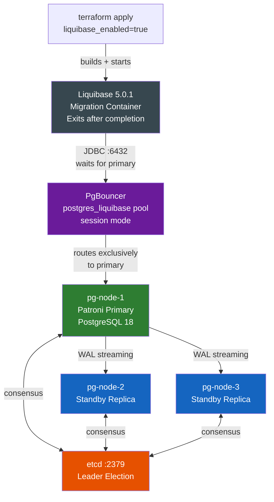
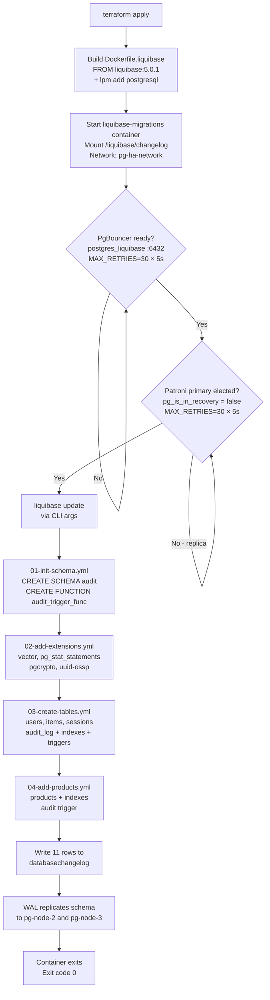
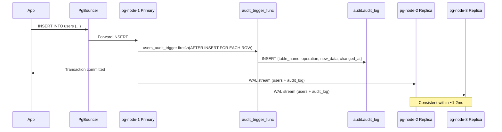
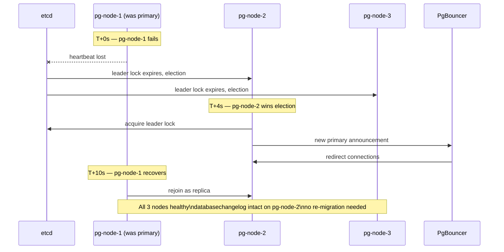

# Liquibase + HA PostgreSQL Architecture

## System Architecture



External access ports:

| Endpoint | Port | Purpose |
| --- | --- | --- |
| PgBouncer (apps) | 6432 / 6433 | Recommended for applications |
| pg-node-1 direct | 5432 | Primary PostgreSQL |
| pg-node-2 direct | 5433 | Replica |
| pg-node-3 direct | 5434 | Replica |
| Patroni API | 8008 / 8009 / 8010 | Cluster health |
| etcd | 2379 | DCS |

## Migration Execution Flow



## Data Flow — Insert Operation with Audit



## Schema After Migrations

```text
PostgreSQL Database: postgres
│
├── Schema: public
│   ├── Table: users
│   │   ├── id (UUID, PK, auto-generated)
│   │   ├── username (VARCHAR, UNIQUE)
│   │   ├── email (VARCHAR, UNIQUE)
│   │   ├── password_hash (VARCHAR)
│   │   ├── created_at / updated_at (TIMESTAMP)
│   │   └── Trigger: users_audit_trigger
│   │
│   ├── Table: items
│   │   ├── id (BIGSERIAL, PK)
│   │   ├── user_id (UUID, FK → users.id)
│   │   ├── name (VARCHAR 512)
│   │   ├── description (TEXT)
│   │   ├── embedding (vector(1536))  ← OpenAI embeddings
│   │   ├── created_at / updated_at (TIMESTAMP)
│   │   ├── Index: idx_items_user_id
│   │   ├── Index: idx_items_embedding (IVFFLAT, lists=100)
│   │   └── Trigger: items_audit_trigger
│   │
│   ├── Table: sessions
│   │   ├── id (UUID, PK, auto-generated)
│   │   ├── user_id (UUID, FK → users.id)
│   │   ├── token (VARCHAR 512, UNIQUE)
│   │   ├── expires_at (TIMESTAMP)
│   │   ├── created_at (TIMESTAMP)
│   │   ├── Index: idx_sessions_user_id
│   │   ├── Index: idx_sessions_expires_at
│   │   └── Trigger: sessions_audit_trigger
│   │
│   ├── Table: products
│   │   ├── id (UUID, PK, auto-generated)
│   │   ├── name (VARCHAR 255, NOT NULL)
│   │   ├── description (TEXT)
│   │   ├── price (DECIMAL 10,2, NOT NULL)
│   │   ├── stock_quantity (INTEGER, default 0)
│   │   ├── created_at / updated_at (TIMESTAMP)
│   │   ├── Index: idx_products_name
│   │   ├── Index: idx_products_price
│   │   └── Trigger: products_audit_trigger
│   │
│   ├── Table: databasechangelog  (Liquibase — 11 rows after full run)
│   └── Table: databasechangeloglock  (Liquibase advisory lock)
│
├── Schema: audit
│   ├── Table: audit_log
│   │   ├── id (BIGSERIAL, PK)
│   │   ├── table_name / operation (VARCHAR)
│   │   ├── old_data / new_data (JSONB)
│   │   ├── changed_at (TIMESTAMP)
│   │   ├── Index: idx_audit_log_table
│   │   └── Index: idx_audit_log_changed_at
│   └── Function: audit_trigger_func()  (plpgsql TRIGGER)
│
└── Extensions
    ├── vector (pgvector) — similarity search
    ├── pg_stat_statements — query analytics
    ├── pgcrypto — cryptographic functions
    └── uuid-ossp — UUID generation
```

## Deployment Timeline

```text
Time  Event
──────────────────────────────────────────────────────────
0s    terraform apply starts
      └─ docker build Dockerfile.liquibase (lpm add postgresql)

~10s  liquibase-migrations container starts
      └─ liquibase-entrypoint.sh begins

~10s  Wait for PgBouncer :6432 (postgres_liquibase pool)
      ├─ Retry until PgBouncer reports ready
      └─ Ensures session pool for advisory lock support

~120s Patroni primary elected (pg-node-1)
      ├─ pg_is_in_recovery() = false on pg-node-1
      └─ Replicas streaming

~121s Execute: liquibase update (11 changesets)
      ├─ 01-init-schema     : audit schema + trigger function  (~300ms)
      ├─ 02-add-extensions  : 4 extensions                    (~600ms)
      ├─ 03-create-tables   : 4 tables + indexes + triggers   (~800ms)
      └─ 04-add-products    : products table + indexes        (~300ms)

~123s Write 11 rows to databasechangelog

~123s Schema replicates to pg-node-2 and pg-node-3 via WAL

~124s Container exits — Exit code 0
      docker ps -a shows: Exited (0)
```

## Failover Scenario



---

**Key Takeaways:**

- Liquibase connects via the `postgres_liquibase` **session-mode** PgBouncer pool — never directly to PostgreSQL. This ensures advisory locks work and routing always hits the primary.
- All 11 changesets execute on the primary, then replicate automatically to standbys via WAL.
- Failover does not affect migration history — `databasechangelog` is replicated.
- Re-running `terraform apply` is safe: Liquibase skips already-executed changesets.
- `04-add-products.yml` includes rollback blocks — use `rollback-count 1` to revert.
