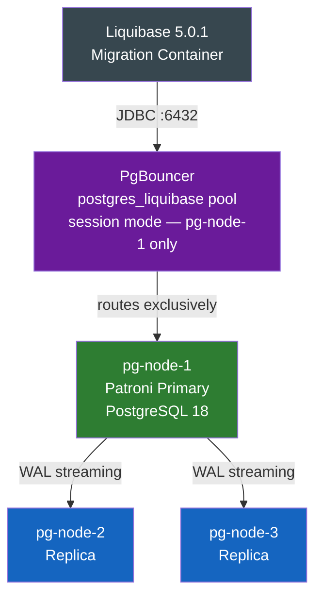

# Liquibase Integration with HA PostgreSQL

## Overview

This integration adds **Liquibase 5.0.1** database migration management to your existing HA PostgreSQL cluster. Liquibase provides:

- **Version Control** for schema changes
- **Rollback Support** for failed migrations
- **Multi-environment Support** (dev, staging, production)
- **Audit Trail** of all database changes
- **Safe Deployments** with validation before execution

## Architecture



Liquibase connects via PgBouncer's `postgres_liquibase` **session-mode** pool, which routes exclusively to pg-node-1. This prevents round-robin routing to replicas and ensures advisory locks (required by Liquibase) work correctly.

## File Structure

```text
.
├── Dockerfile.liquibase              # Liquibase Docker image definition
├── liquibase-entrypoint.sh           # Entrypoint: waits for primary, then runs migrations
├── main-liquibase.tf                 # Terraform configuration for Liquibase container
├── liquibase/
│   ├── liquibase.properties          # Liquibase configuration file
│   └── changelog/
│       ├── db.changelog-master.yml   # Master changelog (includes all migrations in order)
│       ├── 01-init-schema.yml        # Schema initialization (audit schema + trigger function)
│       ├── 02-add-extensions.yml     # PostgreSQL extensions setup
│       ├── 03-create-tables.yml      # Application tables with pgvector support
│       └── 04-add-products.yml       # Products table with audit trigger (e-commerce catalog)
```

## Quick Start

### 1. Deploy with Terraform

The Liquibase container is automatically built and deployed as part of your HA cluster:

```bash
terraform apply -var-file="ha-test.tfvars" -auto-approve
sleep 150   # Wait for Patroni leader election before Liquibase runs
```

### 2. Monitor Migration Progress

```bash
# View Liquibase container logs
docker logs liquibase-migrations

# Check exit status (0 = success)
docker inspect liquibase-migrations --format='{{.State.ExitCode}}'
```

### 3. Verify Migrations

Connect to PostgreSQL and verify schema:

```bash
# Connect via PgBouncer (recommended)
psql -h localhost -p 6432 -U pgadmin -d postgres

# List all tables
\dt

# Check audit log
SELECT * FROM audit.audit_log;

# Verify extensions
SELECT extname FROM pg_extension;
```

## Changelog Structure

### Master Changelog (`db.changelog-master.yml`)

Aggregates all migration files in order. Uses Liquibase 5.x list format:

```yaml
databaseChangeLog:
  - include:
      file: 01-init-schema.yml
  - include:
      file: 02-add-extensions.yml
  - include:
      file: 03-create-tables.yml
  - include:
      file: 04-add-products.yml
```

> **Note:** File paths are relative to the changelog search path root (`/liquibase/changelog/`). Do not use a `changelog/` prefix.

### Migration Files

Each changelog file uses Liquibase 5.x **list syntax** — each `changeSet` must begin with `- changeSet:`:

```yaml
databaseChangeLog:
  - changeSet:
      id: 1-create-audit-schema
      author: liquibase
      description: Create audit schema
      changes:
        - sql:
            sql: CREATE SCHEMA IF NOT EXISTS audit;
      rollback:
        - sql:
            sql: DROP SCHEMA IF EXISTS audit CASCADE;
```

> **Important:** For multi-statement SQL (e.g., PL/pgSQL functions with `$$` dollar quoting), add `splitStatements: false` to the `sql` change to prevent Liquibase from splitting on internal semicolons.

## Included Migrations

### 01-init-schema.yml

- Creates `audit` schema for change tracking
- Creates `audit.audit_trigger_func()` PL/pgSQL function for DML logging (INSERT/UPDATE/DELETE)

### 02-add-extensions.yml

- `vector` - pgvector for embeddings (1536-dim OpenAI support)
- `pg_stat_statements` - Query performance monitoring
- `pgcrypto` - Cryptographic functions
- `uuid-ossp` - UUID generation

### 03-create-tables.yml

#### audit.audit_log

- Tracks all INSERT/UPDATE/DELETE operations
- Stores old/new data as JSONB
- Indexed on table_name and changed_at

#### public.users

- UUID primary key with auto-generation
- Unique constraints on username and email
- Audit triggers enabled

#### public.items (with vector support)

- Links to users via foreign key
- 1536-dimensional OpenAI embeddings
- IVFFLAT vector index for similarity search
- Audit triggers enabled

#### public.sessions

- Session tokens and expiration tracking
- User foreign key with cascade
- Indexes on user_id and expires_at

### 04-add-products.yml

#### public.products

- UUID primary key with auto-generation
- name (VARCHAR 255, NOT NULL), description (TEXT), price (DECIMAL 10,2 NOT NULL)
- stock_quantity (INTEGER, default 0)
- created_at / updated_at timestamps
- Indexes on name and price
- Audit trigger enabled

## Environment Variables

### Database Connection (used by liquibase-entrypoint.sh)

- `DB_HOST` - PostgreSQL host via PgBouncer (default: pgbouncer-1)
- `DB_PORT` - PgBouncer port (default: 6432)
- `DB_NAME` - Session pool name for health check (default: postgres_liquibase)
- `DB_USER` - Database user (default: postgres — superuser required for DDL)
- `DB_PASSWORD` - Database password (required)

### Retry Configuration

- `MAX_RETRIES` - Retry attempts waiting for primary (default: 30)
- `RETRY_INTERVAL` - Seconds between retries (default: 5)

> **Note (Liquibase 5.x):** Connection parameters (`--url`, `--username`, `--password`, `--driver`) are passed directly as CLI arguments, not as `LIQUIBASE_*` environment variables. The Liquibase 5.x env var naming differs from 4.x; the entrypoint uses CLI args for compatibility.

## Adding New Migrations

### Step 1: Create New Changelog File

Use Liquibase 5.x list syntax (`- changeSet:`):

```yaml
# liquibase/changelog/05-add-orders.yml
databaseChangeLog:
  - changeSet:
      id: 1-create-orders-table
      author: your-name
      description: Create orders table
      changes:
        - createTable:
            tableName: orders
            columns:
              - column:
                  name: id
                  type: UUID
                  defaultValueComputed: gen_random_uuid()
                  constraints:
                    primaryKey: true
                    nullable: false
              - column:
                  name: user_id
                  type: UUID
                  constraints:
                    nullable: false
              - column:
                  name: total
                  type: DECIMAL(10,2)
                  constraints:
                    nullable: false
      rollback:
        - dropTable:
            tableName: orders
```

### Step 2: Add to Master Changelog

```yaml
# liquibase/changelog/db.changelog-master.yml
databaseChangeLog:
  - include:
      file: 01-init-schema.yml
  - include:
      file: 02-add-extensions.yml
  - include:
      file: 03-create-tables.yml
  - include:
      file: 04-add-products.yml
  - include:
      file: 05-add-orders.yml   # Add new file here
```

### Step 3: Deploy Migration

```bash
# Rebuild and redeploy
terraform apply -var-file="ha-test.tfvars" -auto-approve

# Monitor progress
docker logs -f liquibase-migrations

# Verify in PostgreSQL
psql -h localhost -p 6432 -U pgadmin -d postgres -c "\dt"
```

## Viewing Migration History

### Liquibase History

```sql
-- Connect to PostgreSQL
psql -h localhost -p 6432 -U pgadmin -d postgres

-- View all applied changes
SELECT id, author, dateexecuted, description
FROM public.databasechangelog
ORDER BY orderexecuted DESC;
```

### Audit Trail

```sql
-- View all database changes
SELECT * FROM audit.audit_log
ORDER BY changed_at DESC
LIMIT 20;

-- View changes to specific table
SELECT * FROM audit.audit_log
WHERE table_name = 'users'
ORDER BY changed_at DESC;

-- View operations by type
SELECT operation, COUNT(*) as count
FROM audit.audit_log
GROUP BY operation;
```

## Rollback Operations

### Rollback Last Migration

```bash
# Run inside the Liquibase container (or using liquibase CLI locally)
liquibase --changeLogFile=db.changelog-master.yml \
          --url="jdbc:postgresql://localhost:6432/postgres" \
          --username=postgres \
          --password="$DB_PASSWORD" \
          rollback-count 1
```

### Rollback to Specific Date

```bash
liquibase --changeLogFile=db.changelog-master.yml \
          --url="jdbc:postgresql://localhost:6432/postgres" \
          --username=postgres \
          --password="$DB_PASSWORD" \
          rollback-to-date 2024-01-15T10:00:00
```

## Configuration Files

### liquibase.properties

Provides defaults for CLI invocations. Connection params passed as CLI args take precedence:

```properties
driver: org.postgresql.Driver
url: jdbc:postgresql://pgbouncer-1:6432/postgres
username: postgres
changeLogFile: db.changelog-master.yml
logLevel: info
```

## Troubleshooting

### Container Exits with Error

```bash
# Check logs for detailed error
docker logs liquibase-migrations

# Common issues:
# 1. PgBouncer not ready — wait 120-150s for Patroni leader election
# 2. Changelog file not found — verify file paths don't have 'changelog/' prefix
# 3. YAML parse error — ensure changesets use '- changeSet:' list syntax
# 4. PL/pgSQL fails — add 'splitStatements: false' to sql change
```

### Failed Migration

```bash
# View error details
docker logs liquibase-migrations | grep -i error

# Check for failed changesets in database
psql -h localhost -p 6432 -U pgadmin -d postgres \
  -c "SELECT id, execstatus, md5sum FROM public.databasechangelog WHERE execstatus != 'EXECUTED';"
```

### Verify Migrations Applied

```bash
# Check applied changesets count
psql -h localhost -p 6432 -U pgadmin -d postgres \
  -c "SELECT COUNT(*) FROM public.databasechangelog;"
# Expected: 11 rows (across 4 changelog files)
```

## Best Practices

1. **One Change Per ChangeSet**: Keep each logical change in its own changeset for granular rollback control
2. **Always Include Rollback**: Provide rollback logic for every changeset
3. **Idempotent Operations**: Use `IF NOT EXISTS` and `IF EXISTS` to prevent errors on re-runs
4. **PL/pgSQL Functions**: Always set `splitStatements: false` and `stripComments: false`
5. **Session Pool for DDL**: Liquibase must connect via the `postgres_liquibase` session pool (not the round-robin `postgres` pool)
6. **Audit Trail**: Review `audit.audit_log` for compliance and troubleshooting

## Performance Considerations

- **Vector Indexes**: IVFFLAT with 100 lists optimized for OpenAI embeddings (1536 dims)
- **Audit Logging**: Triggers on all tables — may impact write performance at high throughput
- **Primary Node Only**: All migrations execute on primary before replicating to standbys
- **Session Mode Required**: The `postgres_liquibase` PgBouncer pool uses session mode to support advisory locks

## References

- [Liquibase Documentation](https://docs.liquibase.com/)
- [Liquibase Best Practices](https://docs.liquibase.com/concepts/bestpractices.html)
- [pgvector Documentation](https://github.com/pgvector/pgvector)
- [PostgreSQL Replication](https://www.postgresql.org/docs/18/warm-standby.html)
- [Patroni Documentation](https://patroni.readthedocs.io/)
