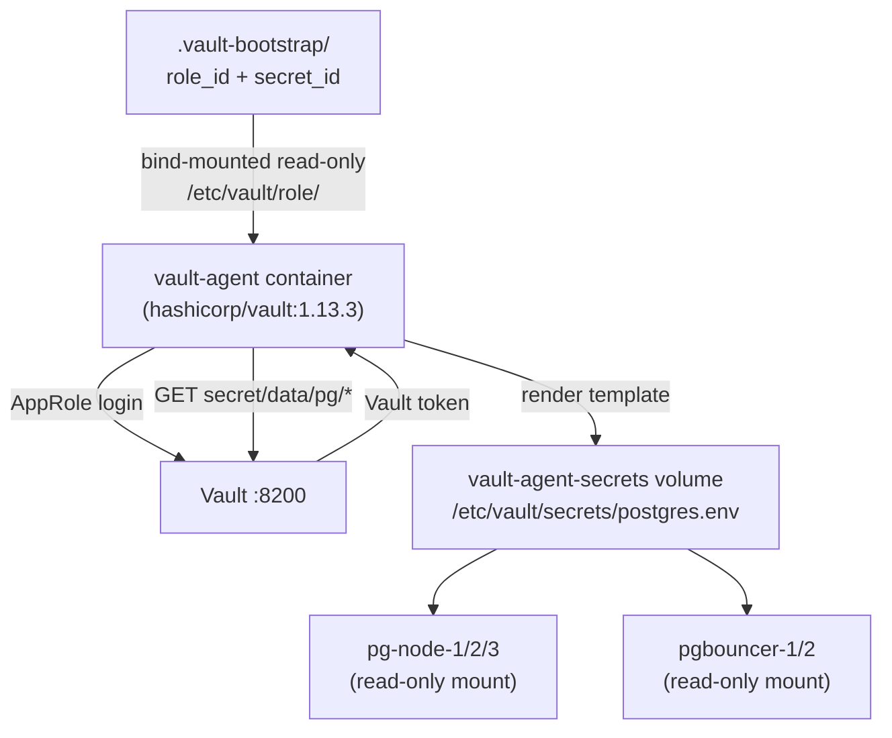

# Vault Agent Sidecar (Prototype)

## Overview

The Vault Agent sidecar securely delivers secrets to containers **without** mounting static AppRole credential files into application containers. The agent handles AppRole login, token renewal, and renders secrets to a shared volume that app containers read at startup.

Controlled by feature flag: `vault_agent_enabled = true` in `ha-test.tfvars`.

---

## Design



The agent runs once per host/cluster. In Kubernetes, use one agent per pod (init container or sidecar injector).

---

## Active Config: `vault/agent/agent.hcl`

```hcl
auto_auth {
  method "approle" {
    mount_path = "auth/approle"
    config = {
      role_id_file_path   = "/etc/vault/role/role_id"
      secret_id_file_path = "/etc/vault/role/secret_id"
    }
  }

  sink "file" {
    config = { path = "/tmp/vault-token" }
  }
}

template {
  source      = "/etc/vault/agent/templates/postgres.hcl"
  destination = "/etc/vault/secrets/postgres.env"
  command     = "true"
}

listener "tcp" {
  address     = "127.0.0.1:8200"
  tls_disable = true
}
```

**Key paths:**

| Path | Note |
| ---- | ---- |
| `/etc/vault/role/role_id` | Bind-mounted from `.vault-bootstrap/role_id` (plain text, 644) |
| `/etc/vault/role/secret_id` | Bind-mounted from `.vault-bootstrap/secret_id` (plain text, 644) |
| `/tmp/vault-token` | Token sink — `/tmp` is always writable by vault user |
| `/etc/vault/secrets/postgres.env` | Rendered output on the shared `vault-agent-secrets` volume |

---

## Active Template: `vault/agent/templates/postgres.hcl`

```hcl
{{ with secret "secret/data/pg/postgres" }}
POSTGRES_USER={{ .Data.data.postgres_user }}
POSTGRES_PASSWORD={{ .Data.data.postgres_password }}
{{ end }}
{{ with secret "secret/data/pg/replication" }}
REPLICATION_PASSWORD={{ .Data.data.replication_password }}
{{ end }}
```

The KV paths match what `vault-bootstrap.sh` seeds during `terraform apply`.

---

## Terraform Integration: `main-vault-agent.tf`

```hcl
resource "docker_image" "vault_agent" {
  count = var.vault_agent_enabled ? 1 : 0
  name  = "hashicorp/vault:1.13.3"
}

resource "docker_volume" "vault_agent_secrets" {
  count = var.vault_agent_enabled ? 1 : 0
  name  = "vault-agent-secrets"
}

# Fix volume ownership so vault user (uid=100) can write rendered files
resource "null_resource" "vault_agent_secrets_perms" {
  count = var.vault_agent_enabled ? 1 : 0
  provisioner "local-exec" {
    command = "docker run --rm -v vault-agent-secrets:/data alpine sh -c 'chown 100:1000 /data && chmod 750 /data'"
  }
  depends_on = [docker_volume.vault_agent_secrets]
}

resource "docker_container" "vault_agent" {
  count   = var.vault_agent_enabled ? 1 : 0
  name    = "vault-agent"
  image   = docker_image.vault_agent[0].image_id
  restart = "unless-stopped"

  env = ["VAULT_ADDR=http://vault:${var.vault_port}"]

  mounts { # agent config + templates
    target    = "/etc/vault/agent"
    source    = abspath("${path.module}/vault/agent")
    type      = "bind"
    read_only = true
  }
  mounts { # rendered secrets (shared with pg-node / pgbouncer)
    target = "/etc/vault/secrets"
    source = docker_volume.vault_agent_secrets[0].name
    type   = "volume"
  }
  mounts { # plain-text role_id / secret_id files
    target    = "/etc/vault/role"
    source    = abspath("${path.module}/.vault-bootstrap")
    type      = "bind"
    read_only = true
  }

  command    = ["agent", "-config=/etc/vault/agent/agent.hcl"]
  depends_on = [null_resource.vault_init, null_resource.vault_agent_secrets_perms]
}
```

pg-node and pgbouncer containers mount the same volume read-only via `dynamic "mounts"` blocks in `main-ha.tf`:

```hcl
dynamic "mounts" {
  for_each = var.vault_agent_enabled ? [1] : []
  content {
    target    = "/etc/vault/secrets"
    source    = docker_volume.vault_agent_secrets[0].name
    type      = "volume"
    read_only = true
  }
}
```

---

## Volume Ownership Note

The Vault Agent process runs as uid=100 (vault user). The Docker volume is created owned by root. The `null_resource.vault_agent_secrets_perms` resource runs an Alpine container to set `chown 100:1000 /data && chmod 750 /data` before the agent starts — otherwise the agent cannot write the rendered `postgres.env`.

---

## Verify the Sidecar

```bash
# Agent logs (should show "template rendered successfully")
docker logs vault-agent --tail=30

# Rendered secrets file (should contain KEY=VALUE lines)
docker exec pg-node-1 cat /etc/vault/secrets/postgres.env

# Verify volume ownership
docker run --rm -v vault-agent-secrets:/data alpine ls -la /data
```

---

## Security Considerations

- `.vault-bootstrap/role_id` and `.vault-bootstrap/secret_id` are bind-mounted read-only; permissions must be 644 so the vault user can read them
- The `vault-agent-secrets` volume is mounted read-only in application containers
- The rendered `postgres.env` file is only visible inside the Docker network — not exposed to the host
- For production (Kubernetes), use the Vault Agent Injector or the sidecar injector pattern with ephemeral identities instead of static AppRole files

---

**See also:**

- [Vault Integration Guide](VAULT-INTEGRATION.md)
- [Vault Quick Start](getting-started/VAULT-QuickStart.md)
- [Vault Troubleshooting](guides/VAULT-TROUBLESHOOTING.md)
- [HashiCorp Vault Agent docs](https://developer.hashicorp.com/vault/docs/agent-and-proxy/agent)
