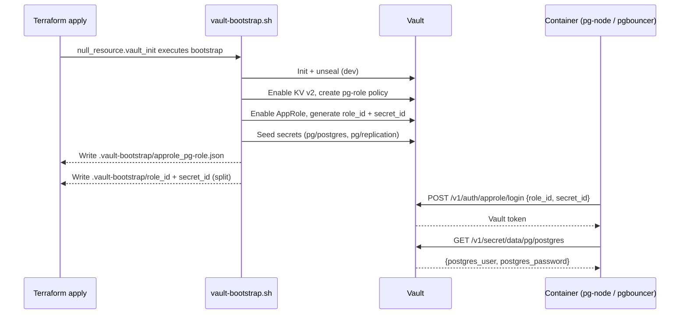

# Vault Integration Guide

## Overview

HashiCorp Vault is integrated as an **optional** secrets management layer for the PostgreSQL HA Terraform + Docker stack. All Vault resources are guarded by feature flags (`vault_enabled`, `vault_agent_enabled`) so the stack runs without Vault by default.

---

## Key Facts

| Property | Value |
| -------- | ----- |
| Image | `hashicorp/vault:1.17.3` |
| Port | `8200` (configurable via `vault_port`) |
| Storage backend | Raft (built-in, no external DB or Redis required) |
| Auth method | AppRole |
| Secrets engine | KV v2 at `secret/` |
| Feature flag | `vault_enabled = true` in `ha-test.tfvars` |
| Sidecar flag | `vault_agent_enabled = true` in `ha-test.tfvars` |

---

## KV Secret Layout

```text
secret/data/pg/postgres     → postgres_user, postgres_password
secret/data/pg/replication  → replication_password
secret/data/pgbouncer       → pgbouncer_user, pgbouncer_password
```

Seeded by `vault-bootstrap.sh` using Terraform-generated passwords.

---

## AppRole Flow



1. Bootstrap creates policy `pg-role` granting read/list on `secret/data/pg/*` and `secret/data/pgbouncer/*`.
2. AppRole is enabled; role_id + secret_id are written to `.vault-bootstrap/` (dev only, gitignored).
3. Terraform mounts `approle_pg-role.json` into containers at `/etc/vault/approle_pg-role.json`.
4. Entrypoints call `vault-secrets.sh` to login via AppRole and fetch KV data.

---

## Vault Agent Sidecar

When `vault_agent_enabled = true`, a `vault-agent` container runs as a sidecar:

- Authenticates with AppRole from `.vault-bootstrap/role_id` + `.vault-bootstrap/secret_id`
- Renders `vault/agent/templates/postgres.hcl` → `/etc/vault/secrets/postgres.env`
- Shares the `vault-agent-secrets` Docker volume with pg-node and pgbouncer containers (read-only)

See [VAULT-AGENT-SIDECAR.md](VAULT-AGENT-SIDECAR.md) for the full sidecar design.

---

## Implementation Files

| File | Purpose |
| ---- | ------- |
| `main-vault-init.tf` | Vault container, volume, network attachment; `null_resource.vault_init` bootstrap |
| `main-vault-agent.tf` | Vault Agent container, `vault-agent-secrets` volume, permission fix |
| `variables-ha.tf` | `vault_enabled`, `vault_agent_enabled`, `vault_port` flags |
| `vault-bootstrap.sh` | Initializes Vault, creates policy/AppRole, seeds KV, calls split script |
| `vault-bootstrap-split.sh` | Splits `approle_<role>.json` → plain-text `role_id` + `secret_id` files |
| `vault-secrets.sh` | Library: `fetch_secret_from_vault()`, `create_secret_in_vault()` |
| `vault/agent/agent.hcl` | Vault Agent config: AppRole auth, token sink, template destination |
| `vault/agent/templates/postgres.hcl` | Consul-template file rendering `postgres.env` from KV v2 |

---

## Bootstrap & Seeding

`vault-bootstrap.sh` runs inside the Vault container during `terraform apply`:

1. Initializes Vault (single unseal key, dev convenience)
2. Uses root token from `vault_root_token` in `ha-test.tfvars` (default: `dev-root-token`)
3. Enables KV v2 at `secret/`
4. Creates `pg-role` policy
5. Enables AppRole; generates role_id + secret_id
6. Seeds secrets with Terraform-generated passwords
7. Calls `vault-bootstrap-split.sh` to write plain-text `role_id` / `secret_id`

---

## Security Notes

- `.vault-bootstrap/` is gitignored — contains live credentials, never commit
- In production, use Vault Agent Injector (K8s) or this sidecar pattern
- Mark Terraform outputs with `sensitive = true` for any credential outputs
- Rotate secret_ids regularly; set a short `secret_id_ttl` in the AppRole role config

---

## Troubleshooting

```bash
# Vault reachability
curl -s http://localhost:8200/v1/sys/health | python3 -m json.tool

# Check AppRole bootstrap files
ls -la .vault-bootstrap/

# Regenerate split files
bash vault-bootstrap-split.sh pg-role
```

See [VAULT-TROUBLESHOOTING.md](guides/VAULT-TROUBLESHOOTING.md) for full diagnostics.

---

**Further reading:**

- [HashiCorp Vault docs](https://developer.hashicorp.com/vault/docs)
- [AppRole auth method](https://developer.hashicorp.com/vault/docs/auth/approle)
- [KV v2 secrets engine](https://developer.hashicorp.com/vault/docs/secrets/kv/kv-v2)
