# 🏗️ Architecture Overview

Complete technical architecture of the PostgreSQL HA cluster with PgBouncer.

## System Architecture

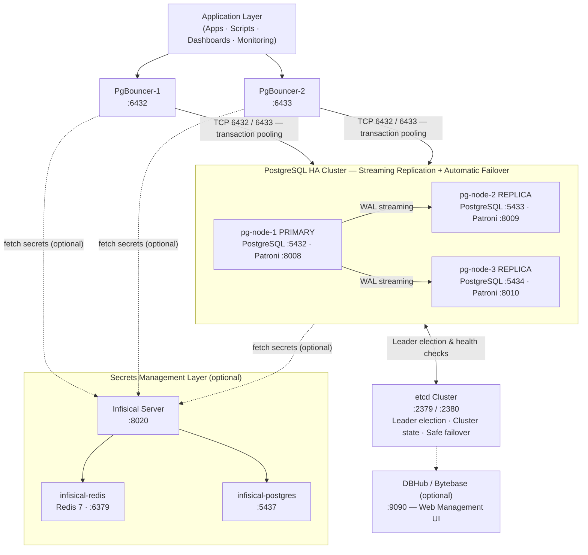

## Component Details

### 1. PostgreSQL Cache (3 Nodes)

#### Primary Node (pg-node-1)

- **Port**: 5432 (PostgreSQL), 8008 (Patroni API)
- **Role**: Accepts writes, replicates to replicas
- **Database**: PostgreSQL 18.2
- **Extensions**: pgvector, uuid-ossp, pg_stat_statements
- **Status**: Elected via etcd consensus

#### Replica Nodes (pg-node-2, pg-node-3)

- **Ports**: 5433/5434 (PostgreSQL), 8009/8010 (Patroni API)
- **Role**: Accept reads, replicate from primary
- **Status**: Continuous streaming replication
- **Promotion**: Can become primary if current primary fails

#### Replication Details

- **Type**: Synchronous stream replication
- **Slots**: Replication slots for safe LSN tracking
- **Connection**: Direct TCP between nodes
- **Topology**: Primary → Replicas (one-way data flow)

### 2. Patroni Orchestration Layer

#### What It Does

- **Leader Election**: Elects primary via etcd quorum
- **Health Checks**: Monitors all nodes every 10 seconds
- **Configuration Management**: Stores config in etcd, applies to all nodes
- **Failover Coordination**: Promotes best replica to primary when needed
- **API Server**: REST endpoint for status and commands

#### How It Works

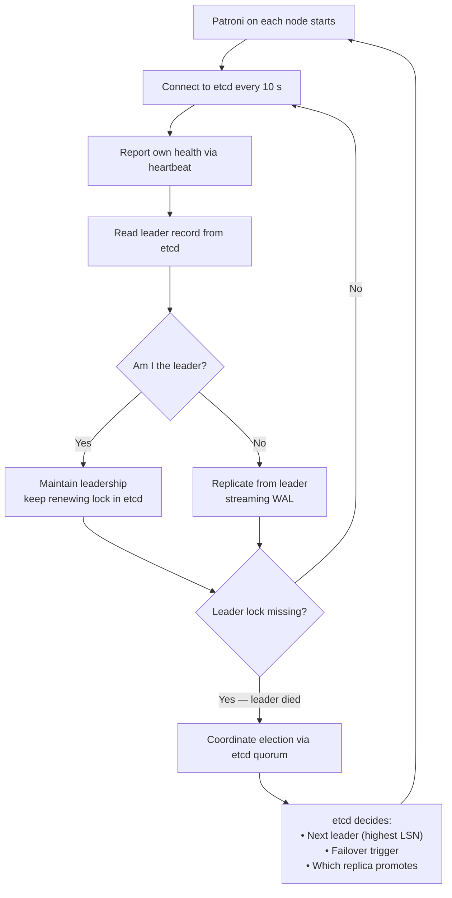

#### Failover Scenario

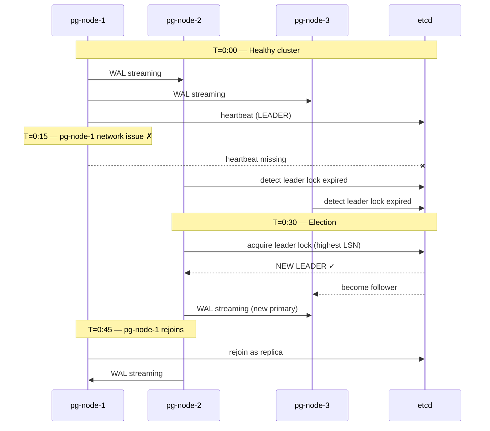

### 3. etcd Distributed Consensus

#### Purpose

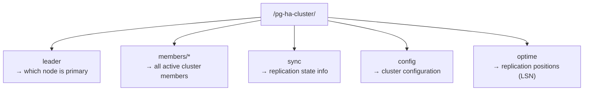

#### How It Ensures Safety

- **Quorum-based**: All changes require majority vote (2/3 nodes)
- **Atomic**: Either all nodes agree or change doesn't happen
- **Persistent**: Data survives container restarts
- **Distributed**: No single point of failure

#### Leader Election Algorithm

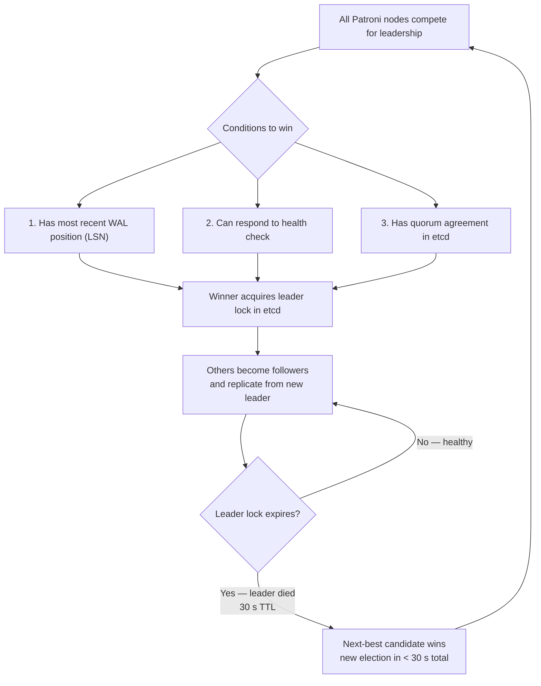

### 4. PgBouncer Connection Pooling

#### Architecture

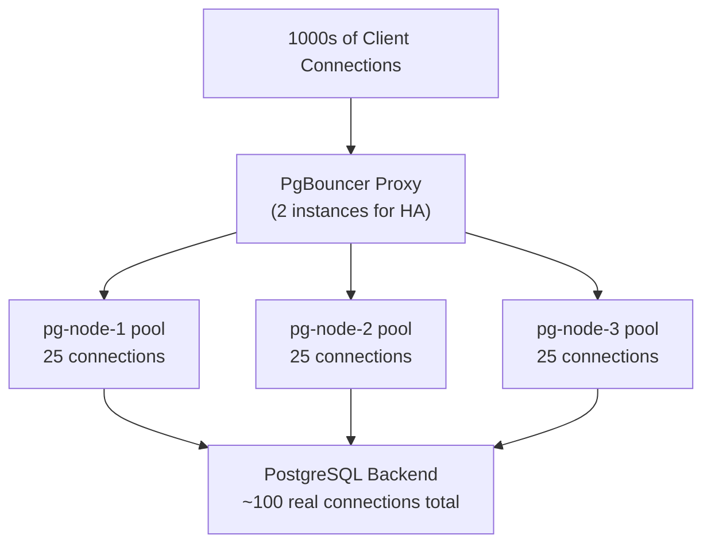

#### How Connection Pooling Works

**Without PgBouncer:**

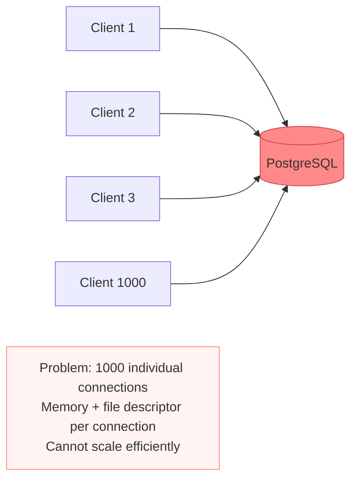

**With PgBouncer:**

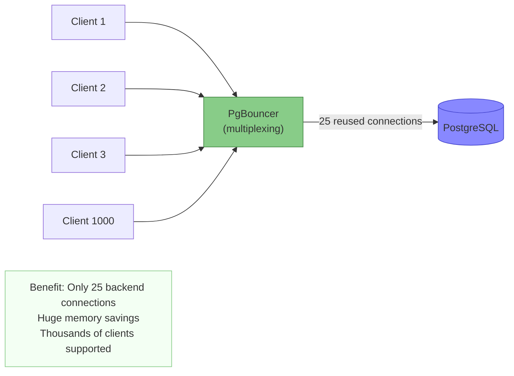

#### Pool Modes

**Transaction Mode (Current)** ✅

1. Client connects to PgBouncer
2. Sends query (SELECT / INSERT / UPDATE)
3. Connection returned to pool after the transaction completes
4. Next client reuses the same backend connection

- **Pro**: Maximum connection reuse, works with all apps
- **Con**: Slight overhead per transaction

---

#### Session Mode

1. Client connects to PgBouncer
2. A connection is assigned from the pool
3. Connection stays assigned for the entire session
4. Session state is preserved

- **Pro**: Faster, lower per-query overhead
- **Con**: Cannot reuse connections across sessions

---

#### Statement Mode

1. Each SQL statement gets a dedicated connection
2. Connection returned immediately after the query

- **Pro**: Maximum connection reuse
- **Con**: Very limited compatibility — breaks many applications

### 5. Network Topology

#### Docker Network

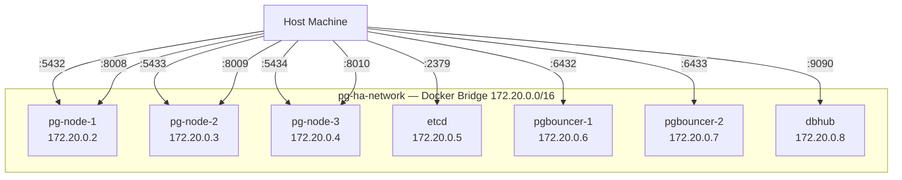

#### Connectivity Flow

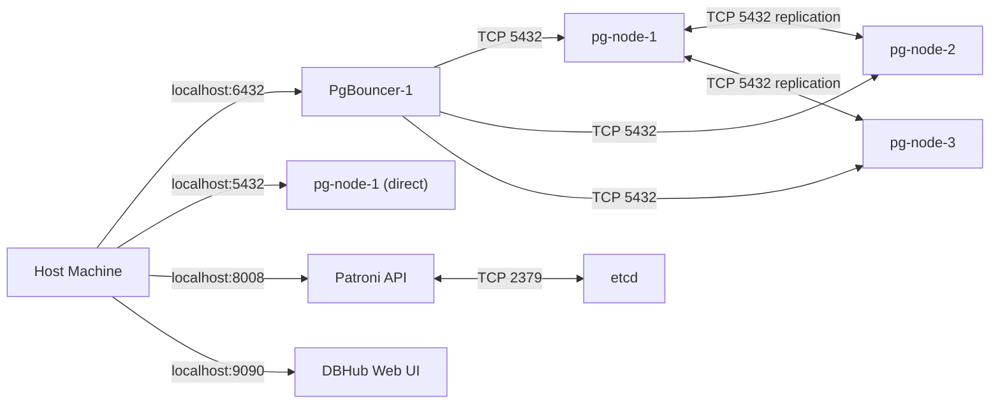

## Data Flow Scenarios

### Scenario 1: Normal Write Operation

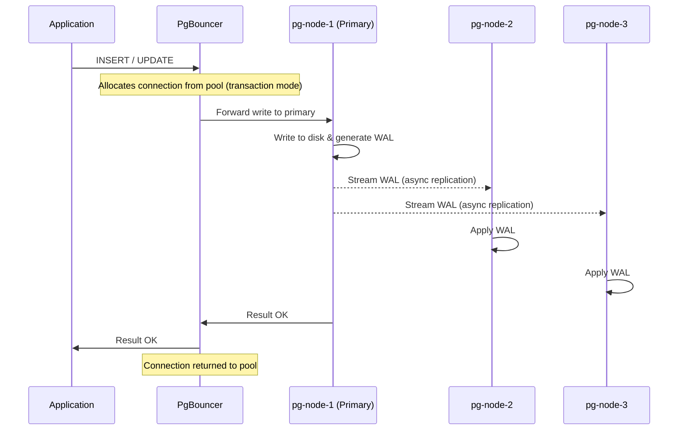

### Scenario 2: Read Operation (via Replica)

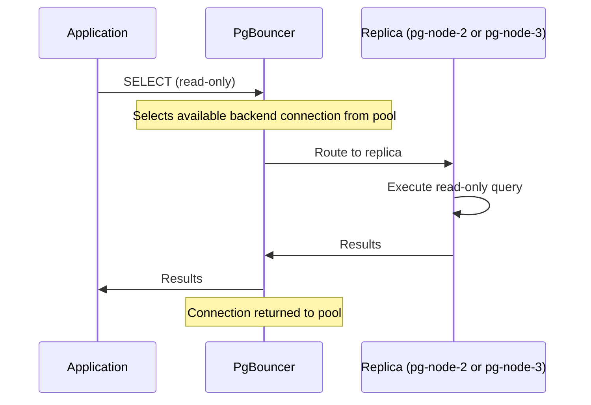

### Scenario 3: Failover Due to Primary Failure

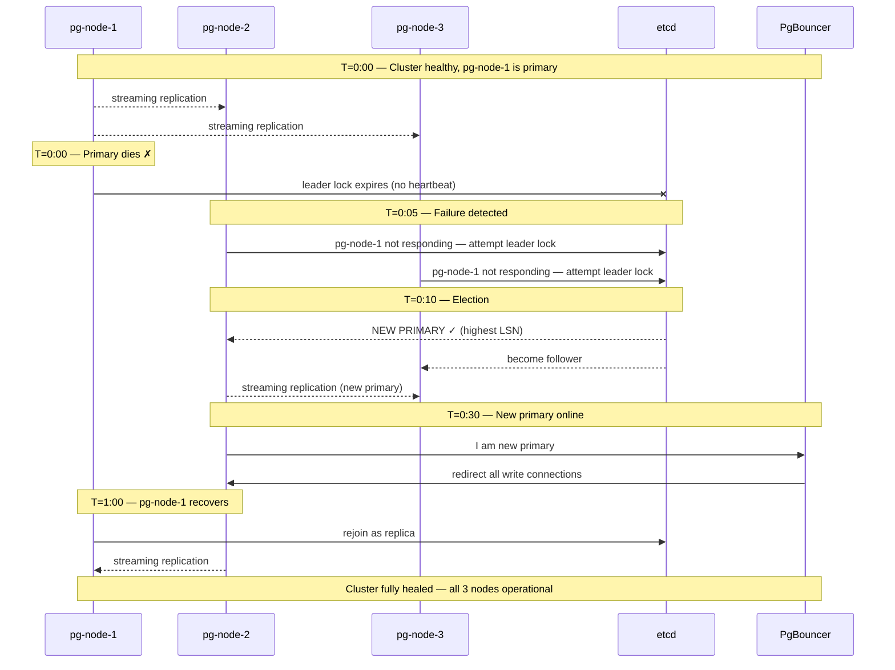

## Resource Requirements

### Minimum (Development)

- **CPU**: 2 cores
- **RAM**: 4 GB
- **Disk**: 10 GB
- **Network**: 100 Mbps

### Recommended (Production)

- **CPU**: 4+ cores
- **RAM**: 16+ GB
- **Disk**: 100+ GB (depends on data volume)
- **Network**: 1 Gbps

### Per Container

| Container | RAM Estimate |
| --------- | ------------ |
| PostgreSQL | ~500 MB + data size |
| Patroni | ~50 MB |
| PgBouncer | ~200 MB + pool buffers |
| etcd | ~100 MB |
| DBHub | ~500 MB |

## Failure Modes & Recovery

| Failure | Detection | Recovery | Downtime |
| ------- | --------- | -------- | -------- |
| Primary PostgreSQL crashes | 10-30 sec | Replica promotes to primary | 30 sec |
| Primary network partition | 10-30 sec | Replica promotes (majority vote) | 30 sec |
| Single replica dies | Patroni notice | Remains offline until manual restart | 0 sec (reads go to other replica) |
| etcd node dies | If 2+ of 3 alive | Cluster continues (quorum maintained) | 0 sec |
| Single PgBouncer dies | Automatic health check | Route via other PgBouncer instance | ~1 sec |
| All PgBouncers die | Clients fail | Direct PostgreSQL connection available | ~5 sec (app reconfiguration) |
| Network partition (minority) | 30 sec | Minority partition shuts down | 30 sec |

## Security Boundaries

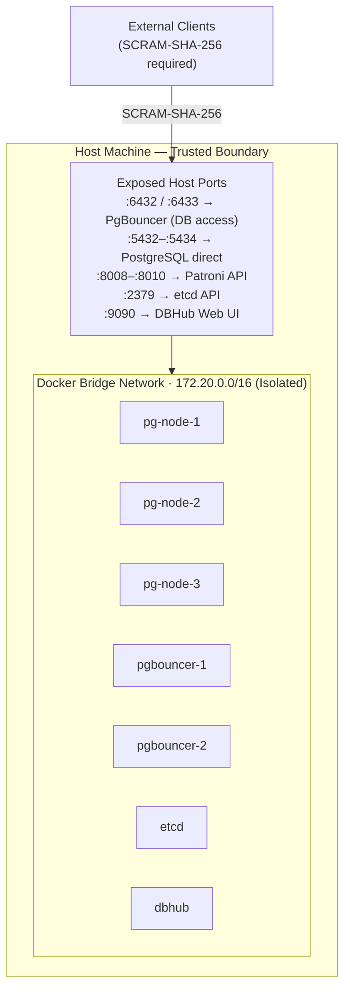

### Default Authentication

- `pgbouncer/userlist.txt` contains hashed passwords
- `auth_type`: SCRAM-SHA-256 (secure hash negotiation with PostgreSQL)
- No TLS: internal network only (not suitable for remote access without a TLS proxy)
- Password authentication required via `PGPASSWORD` env var or connection string

### For Production

- Add TLS/SSL layer (e.g. stunnel, nginx TCP proxy)
- Enable PostgreSQL audit logging (`pgaudit`)
- Restrict port exposure with firewall rules
- Enable application-level authentication

## Performance Characteristics

### Connection Overhead

- **Direct PostgreSQL**: ~5-10ms per new connection
- **PgBouncer pooled**: ~< 1ms (from pool)
- **Network round-trip**: ~1-2ms typical

### Query Latency

- **Simple query**: 1-5ms (network + execution)
- **Complex query**: 50-500ms (depends on query)
- **Connection from pool**: Saves ~10ms per query

### Throughput

- **PgBouncer overhead**: < 5% of query time
- **Replication lag**: < 100ms typical
- **Failover time**: 20-30 seconds

## Scaling Considerations

### Scaling Out (More Replicas)

The current topology ships with 1 Primary + 2 Replicas. Additional replica nodes (pg-node-4, pg-node-5, …) can be added and Patroni will manage them automatically — replication is established to all replicas without manual configuration.

**Trade-offs:**

- More replicas = more WAL shipping overhead
- Better read distribution across replicas
- More failover candidates = higher availability

### Scaling Up (Larger Instances)

Increase container resource limits in `variables-ha.tf`:

- **More CPU** → faster query execution
- **More RAM** → larger working set, fewer disk I/Os
- **More disk** → more data capacity

Tune PgBouncer for higher concurrency:

- Increase `default_pool_size` for more simultaneous queries
- Increase `max_client_conn` to accept more front-end connections

---

## Next Steps

- **[Operations](../guides/02-OPERATIONS.md)** — How to operate this cluster
- **[Troubleshooting](../guides/03-TROUBLESHOOTING.md)** — When things go wrong
- **[Configuration](../../variables-ha.tf)** — All tuning knobs (`variables-ha.tf`)
- **[Quick Start](../getting-started/01-QUICK-START.md)** — Deploy in 5 minutes
