# 🏗️ Architecture Overview

Complete technical architecture of the PostgreSQL HA cluster with PgBouncer.

## System Architecture

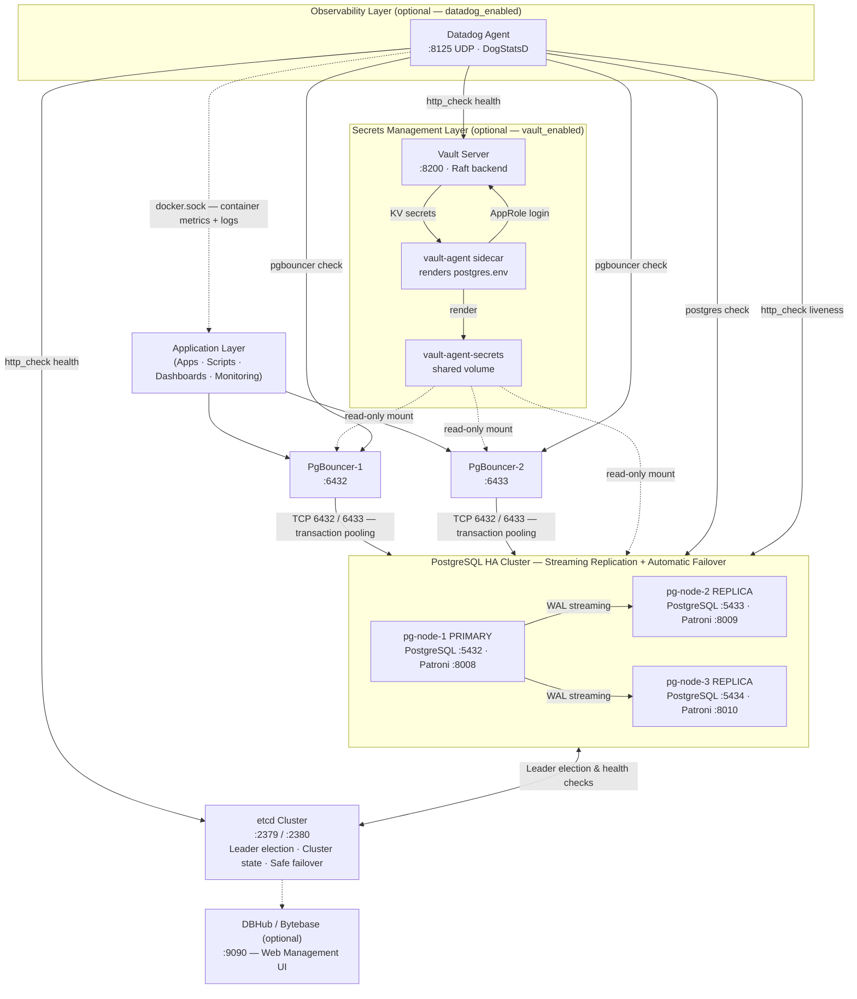
```mermaid
graph TD
    APP["Application Layer<br/>(Apps · Scripts · Dashboards · Monitoring)"]
    PGB1["PgBouncer-1<br/>:6432"]
    PGB2["PgBouncer-2<br/>:6433"]

    subgraph PGHA["PostgreSQL HA Cluster — Streaming Replication + Automatic Failover"]
        PG1["pg-node-1 PRIMARY<br/>PostgreSQL :5432 · Patroni :8008"]
        PG2["pg-node-2 REPLICA<br/>PostgreSQL :5433 · Patroni :8009"]
        PG3["pg-node-3 REPLICA<br/>PostgreSQL :5434 · Patroni :8010"]
    end

    ETCD["etcd Cluster<br/>:2379 / :2380<br/>Leader election · Cluster state · Safe failover"]
    DBHUB["DBHub / Bytebase (optional)<br/>:9090 — Web Management UI"]

    subgraph SECRETS["Secrets Management Layer (optional — vault_enabled)"]
        VAULT["Vault Server<br/>:8200 · Raft backend"]
        AGENT["vault-agent sidecar<br/>renders postgres.env"]
        SVOL["vault-agent-secrets<br/>shared volume"]
    end

    subgraph OBS["Observability Layer (optional — datadog_enabled)"]
        DD["Datadog Agent<br/>:8125 UDP · DogStatsD"]
    end

    APP --> PGB1 & PGB2
    PGB1 & PGB2 -->|"TCP 6432 / 6433 — transaction pooling"| PGHA
    PG1 -->|"WAL streaming"| PG2 & PG3
    PGHA <-->|"Leader election & health checks"| ETCD
    ETCD -.-> DBHUB
    AGENT -->|"AppRole login"| VAULT
    VAULT -->|"KV secrets"| AGENT
    AGENT -->|"render"| SVOL
    SVOL -. "read-only mount" .-> PGHA
    SVOL -. "read-only mount" .-> PGB1 & PGB2
    DD -->|"postgres check"| PGHA
    DD -->|"pgbouncer check"| PGB1 & PGB2
    DD -->|"http_check liveness"| PGHA
    DD -->|"http_check health"| ETCD & VAULT
    DD -. "docker.sock — container metrics + logs" .-> APP
```

## Component Details

### 1. PostgreSQL Cache (3 Nodes)

#### Primary Node (pg-node-1)

- **Port**: 5432 (PostgreSQL), 8008 (Patroni API)
- **Role**: Accepts writes, replicates to replicas
- **Database**: PostgreSQL 18.2
- **Extensions**: pgvector, uuid-ossp, pg_stat_statements
- **Status**: Elected via etcd consensus

#### Replica Nodes (pg-node-2, pg-node-3)

- **Ports**: 5433/5434 (PostgreSQL), 8009/8010 (Patroni API)
- **Role**: Accept reads, replicate from primary
- **Status**: Continuous streaming replication
- **Promotion**: Can become primary if current primary fails

#### Replication Details

- **Type**: Synchronous stream replication
- **Slots**: Replication slots for safe LSN tracking
- **Connection**: Direct TCP between nodes
- **Topology**: Primary → Replicas (one-way data flow)

### 2. Patroni Orchestration Layer

#### What It Does

- **Leader Election**: Elects primary via etcd quorum
- **Health Checks**: Monitors all nodes every 10 seconds
- **Configuration Management**: Stores config in etcd, applies to all nodes
- **Failover Coordination**: Promotes best replica to primary when needed
- **API Server**: REST endpoint for status and commands

#### How It Works

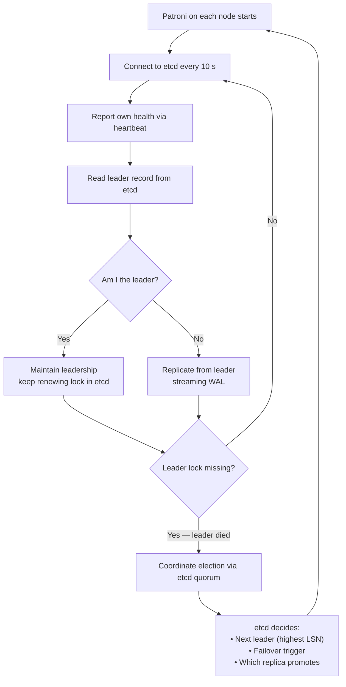
```mermaid
flowchart TD
    A["Patroni on each node starts"] --> B["Connect to etcd every 10 s"]
    B --> C["Report own health via heartbeat"]
    C --> D["Read leader record from etcd"]
    D --> E{Am I the leader?}
    E -->|Yes| F["Maintain leadership<br/>keep renewing lock in etcd"]
    E -->|No| G["Replicate from leader<br/>streaming WAL"]
    F & G --> H{Leader lock missing?}
    H -->|No| B
    H -->|Yes — leader died| I["Coordinate election via etcd quorum"]
    I --> J["etcd decides:<br/>• Next leader (highest LSN)<br/>• Failover trigger<br/>• Which replica promotes"]
    J --> A
```

#### Failover Scenario

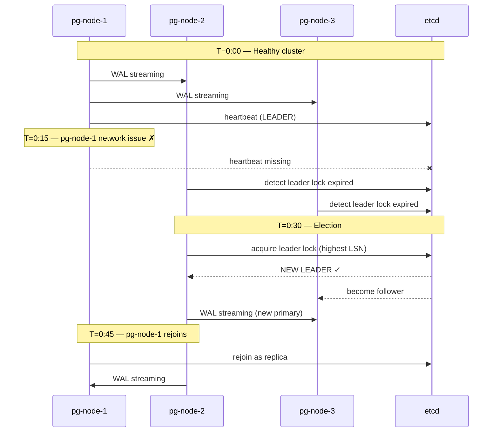
```mermaid
sequenceDiagram
    participant pg1 as pg-node-1
    participant pg2 as pg-node-2
    participant pg3 as pg-node-3
    participant etcd as etcd

    Note over pg1,etcd: T=0:00 — Healthy cluster
    pg1->>pg2: WAL streaming
    pg1->>pg3: WAL streaming
    pg1->>etcd: heartbeat (LEADER)

    Note over pg1: T=0:15 — pg-node-1 network issue ✗
    pg1--xetcd: heartbeat missing
    pg2->>etcd: detect leader lock expired
    pg3->>etcd: detect leader lock expired

    Note over pg2,etcd: T=0:30 — Election
    pg2->>etcd: acquire leader lock (highest LSN)
    etcd-->>pg2: NEW LEADER ✓
    etcd-->>pg3: become follower
    pg2->>pg3: WAL streaming (new primary)

    Note over pg1,pg2: T=0:45 — pg-node-1 rejoins
    pg1->>etcd: rejoin as replica
    pg2->>pg1: WAL streaming
```

### 3. etcd Distributed Consensus

#### Purpose

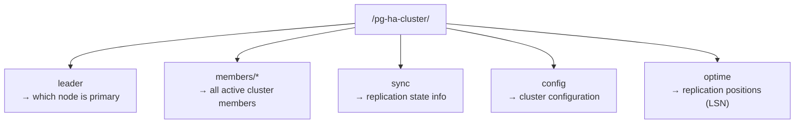
```mermaid
graph TD
    ROOT["/pg-ha-cluster/"] --> LEADER["leader<br/>→ which node is primary"]
    ROOT --> MEMBERS["members/*<br/>→ all active cluster members"]
    ROOT --> SYNC["sync<br/>→ replication state info"]
    ROOT --> CONFIG["config<br/>→ cluster configuration"]
    ROOT --> OPTIME["optime<br/>→ replication positions (LSN)"]
```

#### How It Ensures Safety

- **Quorum-based**: All changes require majority vote (2/3 nodes)
- **Atomic**: Either all nodes agree or change doesn't happen
- **Persistent**: Data survives container restarts
- **Distributed**: No single point of failure

#### Leader Election Algorithm

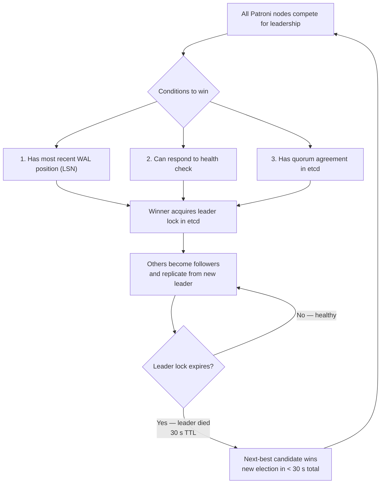
```mermaid
flowchart TD
    A["All Patroni nodes compete for leadership"] --> B{"Conditions to win"}
    B --> C["1. Has most recent WAL position (LSN)"]
    B --> D["2. Can respond to health check"]
    B --> E["3. Has quorum agreement in etcd"]
    C & D & E --> F["Winner acquires leader lock in etcd"]
    F --> G["Others become followers<br/>and replicate from new leader"]
    G --> H{Leader lock expires?}
    H -->|No — healthy| G
    H -->|Yes — leader died<br/>30 s TTL| I["Next-best candidate wins<br/>new election in < 30 s total"]
    I --> A
```

### 4. PgBouncer Connection Pooling

#### Architecture

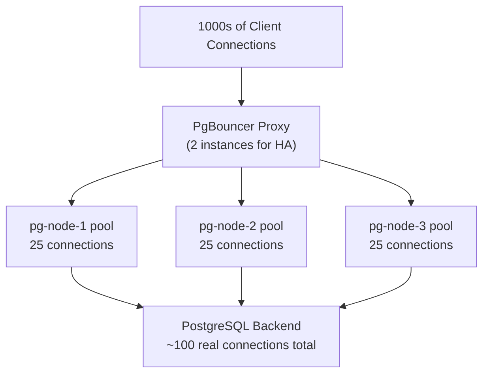
```mermaid
graph TD
    C["1000s of Client Connections"]
    PGB["PgBouncer Proxy<br/>(2 instances for HA)"]
    P1["pg-node-1 pool<br/>25 connections"]
    P2["pg-node-2 pool<br/>25 connections"]
    P3["pg-node-3 pool<br/>25 connections"]
    PG["PostgreSQL Backend<br/>~100 real connections total"]

    C --> PGB
    PGB --> P1 & P2 & P3
    P1 & P2 & P3 --> PG
```

#### How Connection Pooling Works

**Without PgBouncer:**

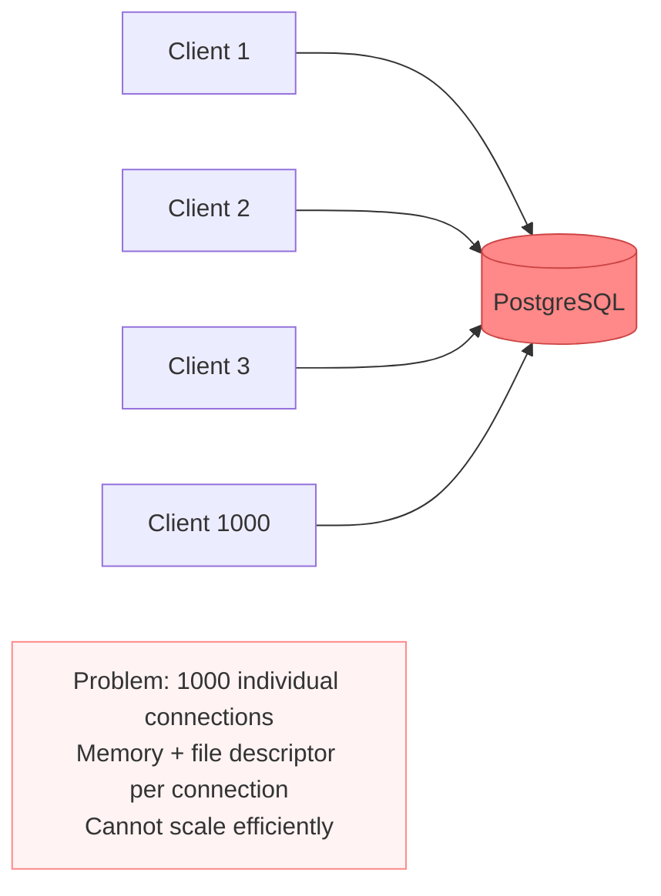
```mermaid
graph LR
    C1["Client 1"] --> PG[("PostgreSQL")]
    C2["Client 2"] --> PG
    C3["Client 3"] --> PG
    CN["Client 1000"] --> PG
    note["Problem: 1000 individual connections<br/>Memory + file descriptor per connection<br/>Cannot scale efficiently"]
    style PG fill:#f88,stroke:#c44
    style note fill:#fff3f3,stroke:#f88
```

**With PgBouncer:**

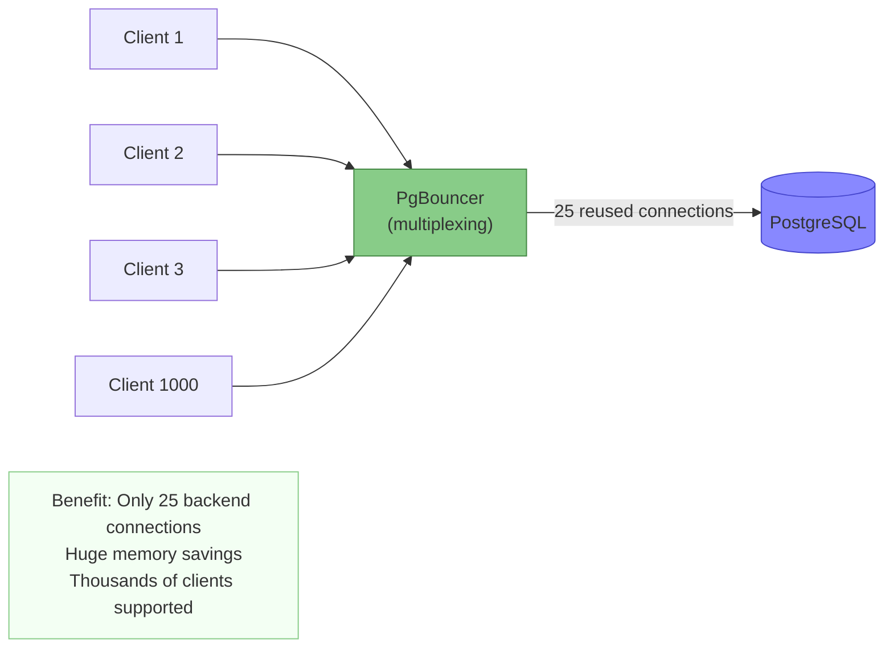
```mermaid
graph LR
    C1["Client 1"] --> PGB["PgBouncer<br/>(multiplexing)"]
    C2["Client 2"] --> PGB
    C3["Client 3"] --> PGB
    CN["Client 1000"] --> PGB
    PGB -->|"25 reused connections"| PG[("PostgreSQL")]
    note["Benefit: Only 25 backend connections<br/>Huge memory savings<br/>Thousands of clients supported"]
    style PGB fill:#8c8,stroke:#484
    style PG fill:#88f,stroke:#44c
    style note fill:#f3fff3,stroke:#8c8
```

#### Pool Modes

**Transaction Mode (Current)** ✅

1. Client connects to PgBouncer
2. Sends query (SELECT / INSERT / UPDATE)
3. Connection returned to pool after the transaction completes
4. Next client reuses the same backend connection

- **Pro**: Maximum connection reuse, works with all apps
- **Con**: Slight overhead per transaction

---

#### Session Mode

1. Client connects to PgBouncer
2. A connection is assigned from the pool
3. Connection stays assigned for the entire session
4. Session state is preserved

- **Pro**: Faster, lower per-query overhead
- **Con**: Cannot reuse connections across sessions

---

#### Statement Mode

1. Each SQL statement gets a dedicated connection
2. Connection returned immediately after the query

- **Pro**: Maximum connection reuse
- **Con**: Very limited compatibility — breaks many applications

### 5. Vault Secrets Management

#### Vault Architecture

Vault runs in **Raft server mode** (embedded single-node, no external storage dependency). vault-agent is a separate sidecar container that authenticates with Vault using AppRole and renders secrets to a shared Docker volume.

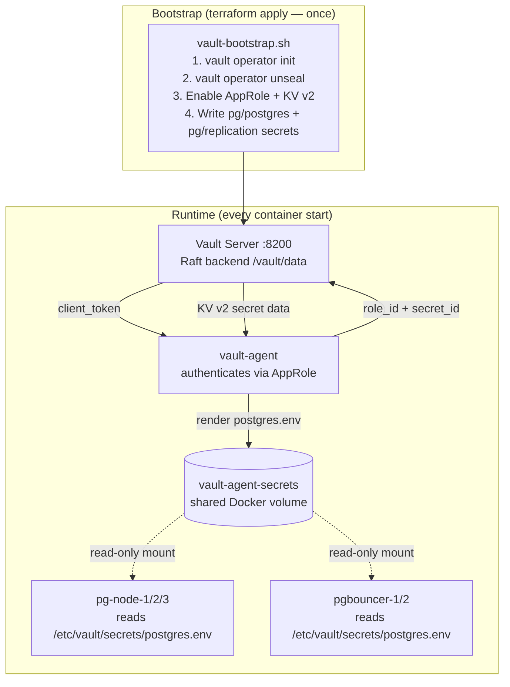
```mermaid
graph TD
    subgraph BOOTSTRAP["Bootstrap (terraform apply — once)"]
        BS["vault-bootstrap.sh<br/>1. vault operator init<br/>2. vault operator unseal<br/>3. Enable AppRole + KV v2<br/>4. Write pg/postgres + pg/replication secrets"]
    end

    subgraph RUNTIME["Runtime (every container start)"]
        AGENT["vault-agent<br/>authenticates via AppRole"]
        VAULT["Vault Server :8200<br/>Raft backend /vault/data"]
        SVOL[("vault-agent-secrets\nshared Docker volume")]
        PG["pg-node-1/2/3<br/>reads /etc/vault/secrets/postgres.env"]
        PGB["pgbouncer-1/2<br/>reads /etc/vault/secrets/postgres.env"]
    end

    BS --> VAULT
    AGENT -->|"role_id + secret_id"| VAULT
    VAULT -->|"client_token"| AGENT
    VAULT -->|"KV v2 secret data"| AGENT
    AGENT -->|"render postgres.env"| SVOL
    SVOL -. "read-only mount" .-> PG
    SVOL -. "read-only mount" .-> PGB
```

#### AppRole Authentication Flow

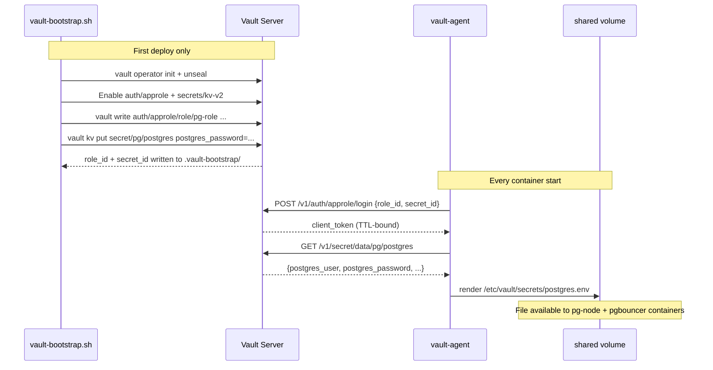
```mermaid
sequenceDiagram
    participant BS as vault-bootstrap.sh
    participant V as Vault Server
    participant AG as vault-agent
    participant VOL as shared volume

    Note over BS,V: First deploy only
    BS->>V: vault operator init + unseal
    BS->>V: Enable auth/approle + secrets/kv-v2
    BS->>V: vault write auth/approle/role/pg-role ...
    BS->>V: vault kv put secret/pg/postgres postgres_password=...
    V-->>BS: role_id + secret_id written to .vault-bootstrap/

    Note over AG,VOL: Every container start
    AG->>V: POST /v1/auth/approle/login {role_id, secret_id}
    V-->>AG: client_token (TTL-bound)
    AG->>V: GET /v1/secret/data/pg/postgres
    V-->>AG: {postgres_user, postgres_password, ...}
    AG->>VOL: render /etc/vault/secrets/postgres.env
    Note over VOL: File available to pg-node + pgbouncer containers
```

#### Secrets Stored in Vault KV v2

| Path | Fields | Consumers |
| ---- | ------ | --------- |
| `secret/data/pg/postgres` | `postgres_user`, `postgres_password` | pg-node, pgbouncer, liquibase |
| `secret/data/pg/replication` | `replication_password` | pg-node (replication slot auth) |

#### Key Files

| File | Purpose |
| ---- | ------- |
| `vault/config/vault.hcl` | Raft backend, `cluster_addr = http://vault:8201`, `api_addr = http://vault:8200` |
| `vault-bootstrap.sh` | One-shot init script; idempotent (checks initialized state before running) |
| `vault-secrets.sh` | Shell library sourced by entrypoints; `fetch_secret_field()`, `create_secret_in_vault()` |
| `main-vault.tf` | Vault container + volume; `null_resource.vault_data_perms` (chown -R 100:1000) |
| `main-vault-agent.tf` | vault-agent container + `vault-agent-secrets` volume |
| `main-vault-init.tf` | `null_resource.vault_init` — triggers `vault-bootstrap.sh` after volume perms are set |
| `.vault-bootstrap/vault-init.json` | Root token + unseal keys (gitignored, chmod 600) |

### 6. Datadog Observability Layer

The Datadog Agent is an optional, feature-flagged container (`datadog_enabled = true`) that provides full-stack observability across every component in the cluster. It is deployed alongside the core stack and shares the same `pg-ha-network` Docker bridge.

#### Datadog Architecture


```mermaid
graph TD
    subgraph AGENT["Datadog Agent Container (datadog-agent)"]
        PG_CHK["postgres check<br/>3 instances: pg-node-1/2/3"]
        PGB_CHK["pgbouncer check<br/>2 instances: pgbouncer-1/2"]
        HTTP_CHK["http_check<br/>Patroni liveness × 3<br/>etcd health<br/>Vault health"]
        DOCKER_CHK["docker check<br/>auto-discovery via /var/run/docker.sock"]
        LOGS["Log pipeline<br/>DD_LOGS_CONFIG_CONTAINER_COLLECT_ALL"]
        STATSD["DogStatsD :8125 UDP<br/>custom app metrics"]
    end

    subgraph TARGETS["Monitored Targets"]
        PG1["pg-node-1 :5432"]
        PG2["pg-node-2 :5432"]
        PG3["pg-node-3 :5432"]
        PGB1["pgbouncer-1 :6432"]
        PGB2["pgbouncer-2 :6432"]
        PAT1["pg-node-1 :8008/liveness"]
        PAT2["pg-node-2 :8009/liveness"]
        PAT3["pg-node-3 :8010/liveness"]
        ETCD["etcd :2379/health"]
        VAULT["vault :8200/v1/sys/health"]
        SOCK["/var/run/docker.sock"]
    end

    PG_CHK -->|"SCRAM-SHA-256"| PG1 & PG2 & PG3
    PGB_CHK -->|"admin console"| PGB1 & PGB2
    HTTP_CHK --> PAT1 & PAT2 & PAT3 & ETCD & VAULT
    DOCKER_CHK -->|"read-only bind"| SOCK
    LOGS -->|"read-only bind"| SOCK
```

#### Integration Check Configuration

Integration configs are **rendered at `terraform apply` time** via `local_file` + `templatefile()` resources in `main-datadog.tf`. The rendered YAML files (with real passwords injected) land in `datadog/rendered/` (gitignored) and are bind-mounted read-only into the container.

| Template | Rendered | Mount path in container |
| -------- | -------- | ----------------------- |
| `datadog/conf.d/postgres.yaml.tpl` | `datadog/rendered/postgres.yaml` | `/etc/datadog-agent/conf.d/postgres.d/conf.yaml` |
| `datadog/conf.d/pgbouncer.yaml.tpl` | `datadog/rendered/pgbouncer.yaml` | `/etc/datadog-agent/conf.d/pgbouncer.d/conf.yaml` |
| `datadog/conf.d/http_check.yaml.tpl` | `datadog/rendered/http_check.yaml` | `/etc/datadog-agent/conf.d/http_check.d/conf.yaml` |

#### Key Metrics Collected

| Check | Example metrics |
| ----- | --------------- |
| `postgres` | `postgresql.connections`, `postgresql.percent_usage_connections`, `postgresql.replication_delay`, `postgresql.database_size`, `postgresql.active_queries` |
| `pgbouncer` | `pgbouncer.pools.sv_active`, `pgbouncer.pools.cl_waiting`, `pgbouncer.stats.total_query_count`, `pgbouncer.stats.avg_query_time` |
| `http_check` | `network.http.can_connect`, `network.http.response_time` — per Patroni node, etcd, and Vault |
| `docker` | `docker.cpu.user`, `docker.mem.rss`, `docker.io.read_bytes` — per container |

#### Agent Health Endpoint

The container overrides the default `agent health` healthcheck (which requires the forwarder to reach `datadoghq.com`) with a lightweight HTTP probe:

```text
DD_HEALTH_PORT=5555
healthcheck: CMD curl -sf http://localhost:5555
```

This avoids false `(unhealthy)` status when using a test/placeholder API key in local development.

#### Feature Flags & Variables

| Variable | Default | Description |
| -------- | ------- | ----------- |
| `datadog_enabled` | `false` | Set `true` to deploy the Datadog Agent container |
| `datadog_api_key` | `""` (sensitive) | Pass via `TF_VAR_datadog_api_key` — never commit |
| `datadog_site` | `datadoghq.com` | Datadog intake endpoint (change for EU: `datadoghq.eu`) |
| `datadog_memory_mb` | `512` | Memory limit for the agent container |
| `datadog_statsd_port` | `8125` | Host-side UDP port for DogStatsD |

#### Verification

```bash
# Full 9-section health report
bash datadog-health-check.sh

# Individual integration checks
docker exec datadog-agent agent check postgres
docker exec datadog-agent agent check pgbouncer
docker exec datadog-agent agent check http_check

# Full agent status
docker exec datadog-agent agent status

# Tail logs
docker logs datadog-agent -f
```

### 7. Network Topology

#### Docker Network

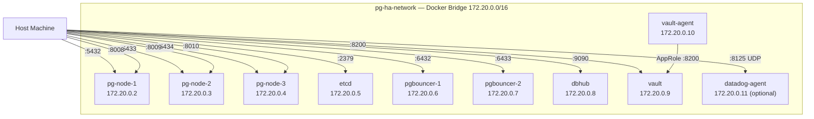
```mermaid
graph TD
    subgraph NET["pg-ha-network — Docker Bridge 172.20.0.0/16"]
        PG1["pg-node-1<br/>172.20.0.2"]
        PG2["pg-node-2<br/>172.20.0.3"]
        PG3["pg-node-3<br/>172.20.0.4"]
        ETCD["etcd<br/>172.20.0.5"]
        PGB1["pgbouncer-1<br/>172.20.0.6"]
        PGB2["pgbouncer-2<br/>172.20.0.7"]
        DBHUB["dbhub<br/>172.20.0.8"]
        VAULT["vault<br/>172.20.0.9"]
        VAGENT["vault-agent<br/>172.20.0.10"]
        DD["datadog-agent<br/>172.20.0.11 (optional)"]
    end

    HOST["Host Machine"]
    HOST -->|":5432"| PG1
    HOST -->|":5433"| PG2
    HOST -->|":5434"| PG3
    HOST -->|":6432"| PGB1
    HOST -->|":6433"| PGB2
    HOST -->|":8008"| PG1
    HOST -->|":8009"| PG2
    HOST -->|":8010"| PG3
    HOST -->|":2379"| ETCD
    HOST -->|":8200"| VAULT
    HOST -->|":8125 UDP"| DD
    HOST -->|":9090"| DBHUB
    VAGENT -->|"AppRole :8200"| VAULT
```

#### Connectivity Flow

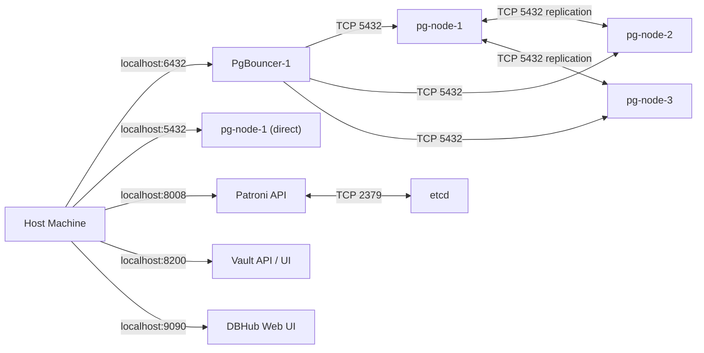
```mermaid
graph LR
    HOST["Host Machine"]
    PGB1["PgBouncer-1"]
    PG1D["pg-node-1 (direct)"]
    PAT["Patroni API"]
    DBH["DBHub Web UI"]
    PG1["pg-node-1"]
    PG2["pg-node-2"]
    PG3["pg-node-3"]
    ETCD["etcd"]

    HOST -->|"localhost:6432"| PGB1
    HOST -->|"localhost:5432"| PG1D
    HOST -->|"localhost:8008"| PAT
    HOST -->|"localhost:8200"| VLT["Vault API / UI"]
    HOST -->|"localhost:9090"| DBH
    PGB1 -->|"TCP 5432"| PG1 & PG2 & PG3
    PAT <-->|"TCP 2379"| ETCD
    PG1 <-->|"TCP 5432 replication"| PG2 & PG3
```

## Data Flow Scenarios

### Scenario 1: Normal Write Operation

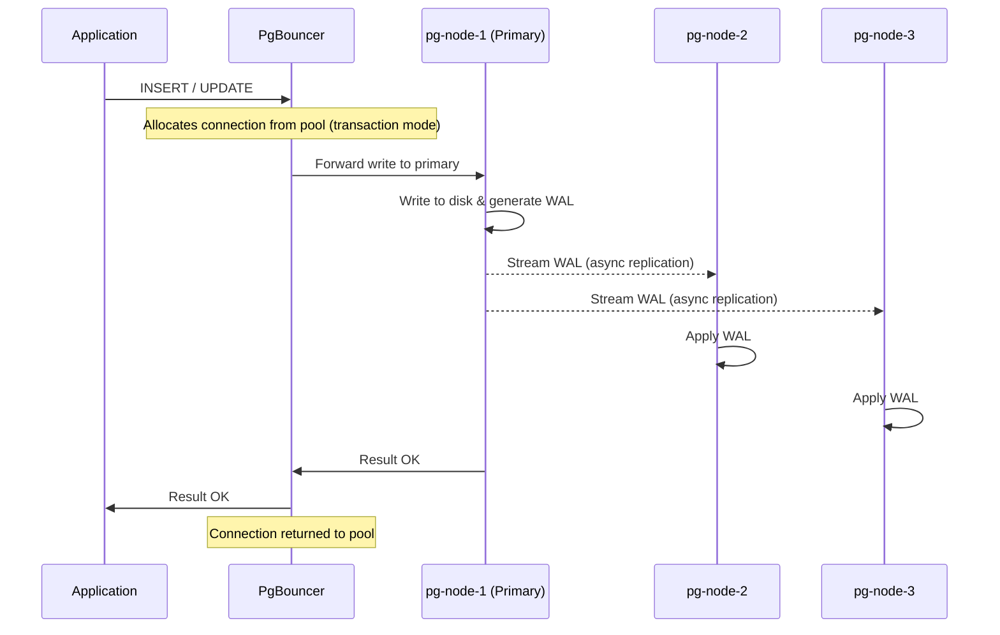
```mermaid
sequenceDiagram
    participant App as Application
    participant PGB as PgBouncer
    participant PG1 as pg-node-1 (Primary)
    participant PG2 as pg-node-2
    participant PG3 as pg-node-3

    App->>PGB: INSERT / UPDATE
    Note over PGB: Allocates connection from pool (transaction mode)
    PGB->>PG1: Forward write to primary
    PG1->>PG1: Write to disk & generate WAL
    PG1-->>PG2: Stream WAL (async replication)
    PG1-->>PG3: Stream WAL (async replication)
    PG2->>PG2: Apply WAL
    PG3->>PG3: Apply WAL
    PG1->>PGB: Result OK
    PGB->>App: Result OK
    Note over PGB: Connection returned to pool
```

### Scenario 2: Read Operation (via Replica)

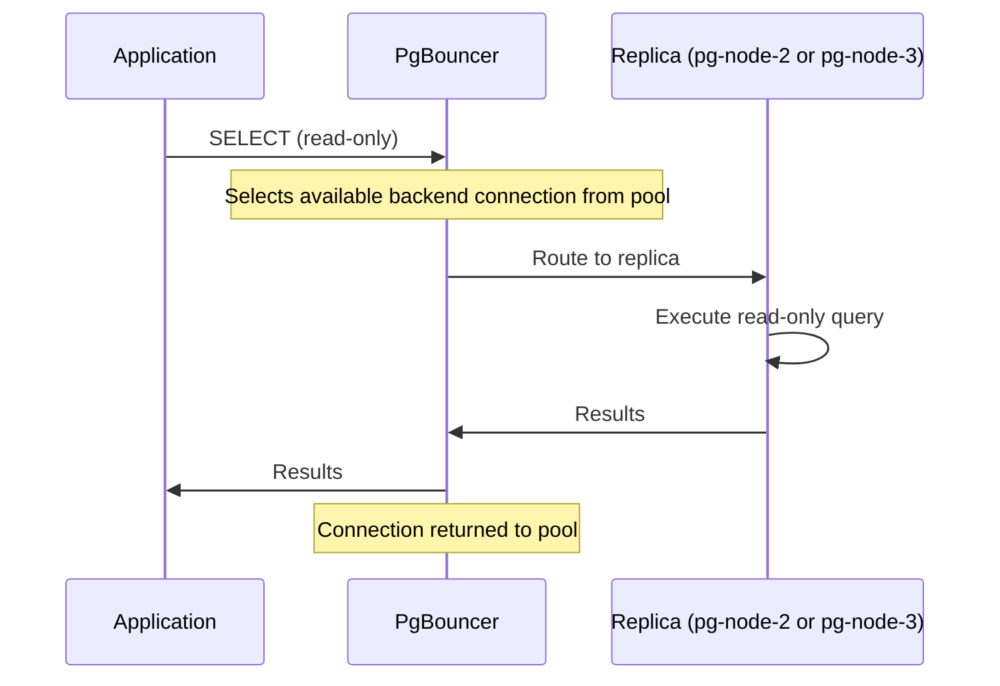
```mermaid
sequenceDiagram
    participant App as Application
    participant PGB as PgBouncer
    participant REP as Replica (pg-node-2 or pg-node-3)

    App->>PGB: SELECT (read-only)
    Note over PGB: Selects available backend connection from pool
    PGB->>REP: Route to replica
    REP->>REP: Execute read-only query
    REP->>PGB: Results
    PGB->>App: Results
    Note over PGB: Connection returned to pool
```

### Scenario 3: Failover Due to Primary Failure

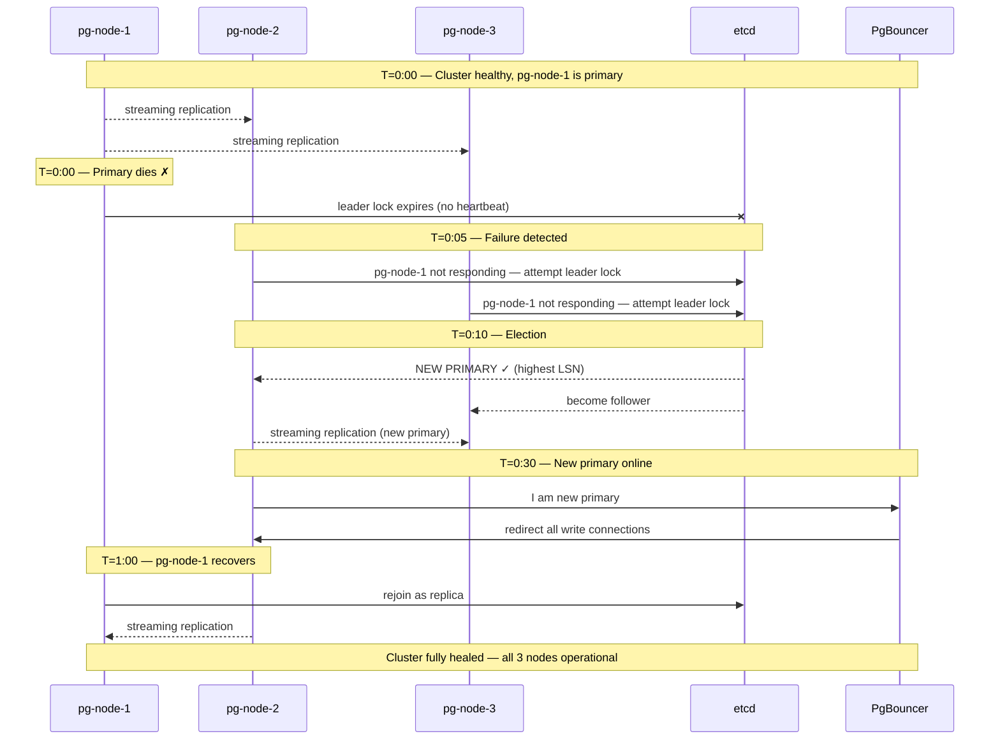
```mermaid
sequenceDiagram
    participant pg1 as pg-node-1
    participant pg2 as pg-node-2
    participant pg3 as pg-node-3
    participant etcd as etcd
    participant PGB as PgBouncer

    Note over pg1,PGB: T=0:00 — Cluster healthy, pg-node-1 is primary
    pg1-->>pg2: streaming replication
    pg1-->>pg3: streaming replication

    Note over pg1: T=0:00 — Primary dies ✗
    pg1-xetcd: leader lock expires (no heartbeat)

    Note over pg2,etcd: T=0:05 — Failure detected
    pg2->>etcd: pg-node-1 not responding — attempt leader lock
    pg3->>etcd: pg-node-1 not responding — attempt leader lock

    Note over pg2,etcd: T=0:10 — Election
    etcd-->>pg2: NEW PRIMARY ✓ (highest LSN)
    etcd-->>pg3: become follower
    pg2-->>pg3: streaming replication (new primary)

    Note over pg2,PGB: T=0:30 — New primary online
    pg2->>PGB: I am new primary
    PGB->>pg2: redirect all write connections

    Note over pg1,pg2: T=1:00 — pg-node-1 recovers
    pg1->>etcd: rejoin as replica
    pg2-->>pg1: streaming replication
    Note over pg1,PGB: Cluster fully healed — all 3 nodes operational
```

## Resource Requirements

### Minimum (Development)

- **CPU**: 2 cores
- **RAM**: 4 GB
- **Disk**: 10 GB
- **Network**: 100 Mbps

### Recommended (Production)

- **CPU**: 4+ cores
- **RAM**: 16+ GB
- **Disk**: 100+ GB (depends on data volume)
- **Network**: 1 Gbps

### Per Container

| Container | RAM Estimate |
| --------- | ------------ |
| PostgreSQL | ~500 MB + data size |
| Patroni | ~50 MB |
| PgBouncer | ~200 MB + pool buffers |
| etcd | ~100 MB |
| Vault | ~200 MB + Raft storage |
| vault-agent | ~50 MB |
| Datadog Agent | ~512 MB (configurable via `datadog_memory_mb`) |
| DBHub | ~500 MB |

## Failure Modes & Recovery

| Failure | Detection | Recovery | Downtime |
| ------- | --------- | -------- | -------- |
| Primary PostgreSQL crashes | 10-30 sec | Replica promotes to primary | 30 sec |
| Primary network partition | 10-30 sec | Replica promotes (majority vote) | 30 sec |
| Single replica dies | Patroni notice | Remains offline until manual restart | 0 sec (reads go to other replica) |
| etcd node dies | If 2+ of 3 alive | Cluster continues (quorum maintained) | 0 sec |
| Single PgBouncer dies | Automatic health check | Route via other PgBouncer instance | ~1 sec |
| All PgBouncers die | Clients fail | Direct PostgreSQL connection available | ~5 sec (app reconfiguration) |
| Network partition (minority) | 30 sec | Minority partition shuts down | 30 sec |
| Vault sealed (after restart) | Container startup | `vault operator unseal $(jq -r '.unseal_keys_b64[0]' .vault-bootstrap/vault-init.json)` | 0 sec (DB containers keep cached `postgres.env` until next restart) |
| vault-agent crashes | Container health check | Docker restarts agent; re-authenticates and re-renders secrets | 0 sec (secret file already rendered) |
| Vault data volume lost | Manual detection | Re-run `vault-bootstrap.sh` after recreating volume; rotate all secrets | Full re-bootstrap required |
| Datadog Agent crashes | Container health check | Docker restarts agent (`restart = "unless-stopped"`); metrics resume after ~60 s start period | 0 sec (no data path dependency) |
| Datadog Agent unhealthy | `DD_HEALTH_PORT=5555` probe | Check API key validity; review `docker logs datadog-agent`; run `bash datadog-health-check.sh` | 0 sec (observability-only, not on data path) |

## Security Boundaries

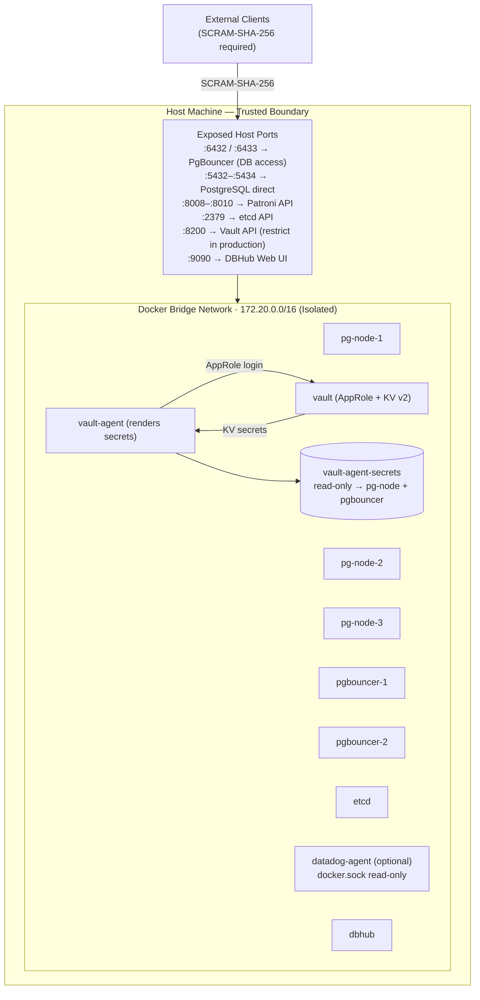
```mermaid
graph TD
    EXT["External Clients<br/>(SCRAM-SHA-256 required)"]

    subgraph HOST["Host Machine — Trusted Boundary"]
        PORTS["Exposed Host Ports<br/>:6432 / :6433 → PgBouncer (DB access)<br/>:5432–:5434 → PostgreSQL direct<br/>:8008–:8010 → Patroni API<br/>:2379 → etcd API<br/>:8200 → Vault API (restrict in production)<br/>:9090 → DBHub Web UI"]

        subgraph DOCKER["Docker Bridge Network · 172.20.0.0/16 (Isolated)"]
            PG1["pg-node-1"] & PG2["pg-node-2"] & PG3["pg-node-3"]
            PGB1["pgbouncer-1"] & PGB2["pgbouncer-2"]
            ETCD["etcd"]
            VAULT["vault (AppRole + KV v2)"]
            VAGENT["vault-agent (renders secrets)"]
            SVOL[("vault-agent-secrets\nread-only → pg-node + pgbouncer")]
            DD["datadog-agent (optional)\ndocker.sock read-only"]
            DBHUB["dbhub"]
        end
    end

    EXT -->|"SCRAM-SHA-256"| PORTS
    PORTS --> DOCKER
    VAGENT -->|"AppRole login"| VAULT
    VAULT -->|"KV secrets"| VAGENT
    VAGENT --> SVOL
```

### Default Authentication

- `pgbouncer/userlist.txt` contains hashed passwords
- `auth_type`: SCRAM-SHA-256 (secure hash negotiation with PostgreSQL)
- No TLS: internal network only (not suitable for remote access without a TLS proxy)
- Password authentication required via `PGPASSWORD` env var or connection string

### For Production

- Add TLS/SSL layer (e.g. stunnel, nginx TCP proxy)
- Enable PostgreSQL audit logging (`pgaudit`)
- Restrict port exposure with firewall rules — especially Vault `:8200`
- Enable `vault_enabled = true` for centralized secrets management
- Rotate Vault AppRole `secret_id` on a regular schedule
- Enable application-level authentication

## Performance Characteristics

### Connection Overhead

- **Direct PostgreSQL**: ~5-10ms per new connection
- **PgBouncer pooled**: ~< 1ms (from pool)
- **Network round-trip**: ~1-2ms typical

### Query Latency

- **Simple query**: 1-5ms (network + execution)
- **Complex query**: 50-500ms (depends on query)
- **Connection from pool**: Saves ~10ms per query

### Throughput

- **PgBouncer overhead**: < 5% of query time
- **Replication lag**: < 100ms typical
- **Failover time**: 20-30 seconds

## Scaling Considerations

### Scaling Out (More Replicas)

The current topology ships with 1 Primary + 2 Replicas. Additional replica nodes (pg-node-4, pg-node-5, …) can be added and Patroni will manage them automatically — replication is established to all replicas without manual configuration.

**Trade-offs:**

- More replicas = more WAL shipping overhead
- Better read distribution across replicas
- More failover candidates = higher availability

### Scaling Up (Larger Instances)

Increase container resource limits in `variables-ha.tf`:

- **More CPU** → faster query execution
- **More RAM** → larger working set, fewer disk I/Os
- **More disk** → more data capacity

Tune PgBouncer for higher concurrency:

- Increase `default_pool_size` for more simultaneous queries
- Increase `max_client_conn` to accept more front-end connections

---

## Next Steps

- **[Operations](../guides/02-OPERATIONS.md)** — How to operate this cluster
- **[Troubleshooting](../guides/03-TROUBLESHOOTING.md)** — When things go wrong
- **[Configuration](../../variables-ha.tf)** — All tuning knobs (`variables-ha.tf`)
- **[Quick Start](../getting-started/01-QUICK-START.md)** — Deploy in 5 minutes
