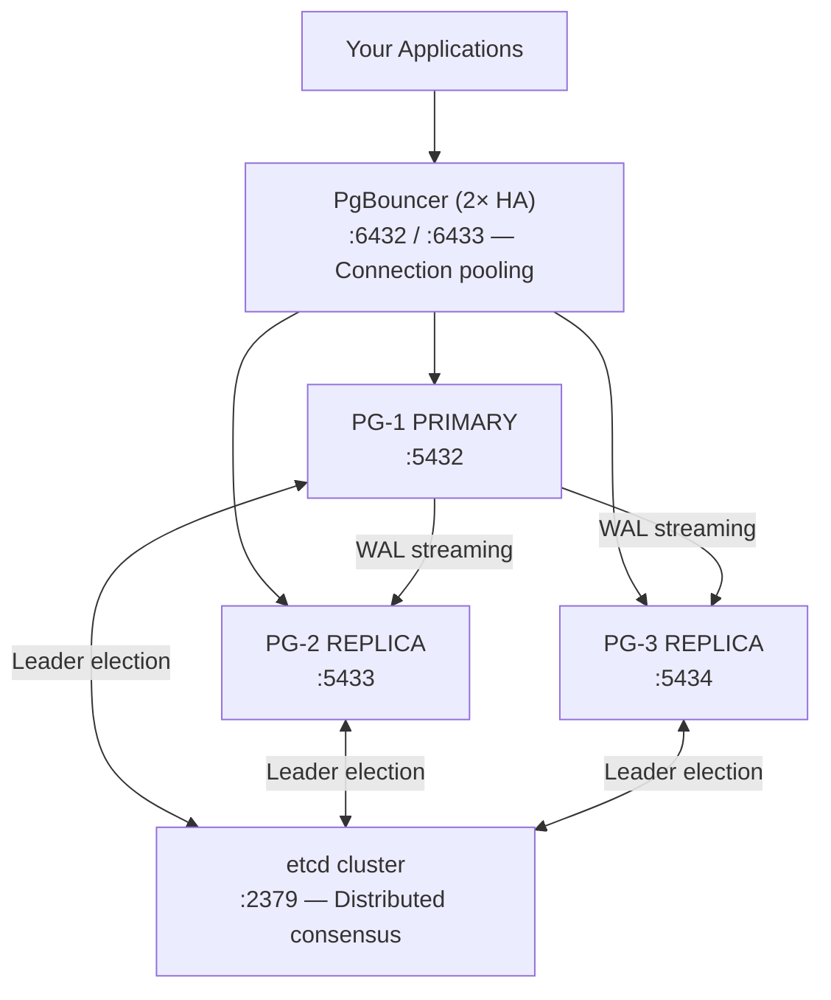

# 📖 New User Guide — Complete Overview

Welcome! This guide gives you a complete understanding of your PostgreSQL HA infrastructure.

## What You Have

You've deployed a **production-ready PostgreSQL HA cluster** with high availability, automatic failover, and connection pooling. Here's the architecture:



## Inside This Cluster

### 🐘 PostgreSQL (3 Nodes)

- **Version**: PostgreSQL 18.2
- **Replication**: Synchronous streaming (no data loss)
- **Extensions**: pgvector (AI/ML), uuid-ossp, pg_stat_statements
- **HA Features**: Automatic failover in < 30 seconds
- **Ports**: 5432–5434 (one per node)

### ⚙️ Patroni

- **Role**: Cluster orchestration and management
- **Function**: Elects leader, manages replicas, handles failover
- **API**: REST endpoints for monitoring (ports 8008–8010)

### 🔀 PgBouncer

- **Role**: Connection pooling proxy
- **Instances**: 2 (for high availability)
- **Pool Mode**: Transaction-level (default)
- **Ports**: 6432, 6433
- **Benefits**: Handles 1000s of concurrent connections with just ~100 backend connections

### 💾 etcd

- **Role**: Distributed configuration store
- **Function**: Stores cluster state, leader election
- **Ports**: 2379–2380

### 🌐 DBHub (Bytebase)

- **Role**: Web-based database management UI
- **Access**: http://localhost:9090
- **Features**: Query execution, schema browser, migrations

## Key Capabilities

### ✅ High Availability

- **Automatic Failover**: If primary fails, a replica becomes primary in < 30 sec
- **No Single Point of Failure**: etcd provides distributed consensus (3-way vote)
- **Replication**: Data synced to replicas continuously

### ✅ Connection Pooling

- **Reduce Overhead**: PgBouncer reuses connections (vs creating new ones)
- **Support Scaling**: Handle thousands of client connections with fewer backend connections
- **Admin Console**: Monitor pools, connections, statistics in real-time

### ✅ Observability

- **Cluster API**: REST endpoints show real-time cluster status
- **Web UI**: Visual database management at http://localhost:9090
- **Logs**: All container logs available via `docker logs`

### ✅ Production Ready

- **Tested**: 35/35 assertions across 12 tests passed
- **Documented**: Comprehensive guides for every operation
- **Monitored**: Health checks, admin console, log aggregation

## Common Scenarios

### Scenario 1: I Want to Query the Database

**Get your password first:**

```bash
terraform output generated_passwords
```

**Option A: Via PgBouncer (Recommended)**

```bash
# Method 1: Environment variable
export PGPASSWORD='<password from generated_passwords>'
psql -h localhost -p 6432 -U pgadmin -d postgres
unset PGPASSWORD

# Method 2: Interactive password prompt
psql -h localhost -p 6432 -U pgadmin -d postgres -W

# Method 3: Connection string
psql "postgresql://pgadmin:<password from generated_passwords>@localhost:6432/postgres"
```

**Option B: Direct to Primary**

```bash
export PGPASSWORD='<password from generated_passwords>'
psql -h localhost -p 5432 -U pgadmin -d postgres
```

**Option C: Direct to Replica (Read-Only)**

```bash
export PGPASSWORD='<password from generated_passwords>'
psql -h localhost -p 5433 -U pgadmin -d postgres  # Replica 1
psql -h localhost -p 5434 -U pgadmin -d postgres  # Replica 2
```

**Recommendation**: Use PgBouncer (Option A) for all applications. See [PgBouncer Authentication](../pgbouncer/AUTHENTICATION.md) for detailed password handling options.

### Scenario 2: The Primary Failed — What Happens?

1. **Failure Detected** (within 30 seconds)
   - Patroni notices pg-node-1 is unresponsive
   - etcd records the failure

2. **Election Happens** (within 1 second)
   - etcd votes on next leader
   - pg-node-2 or pg-node-3 becomes primary

3. **Your App Reconnects** (transparent)
   - PgBouncer detects new primary
   - Connections redirect automatically
   - Most applications see no interruption

**Test this yourself:**

```bash
docker stop pg-node-1          # Simulate failure
sleep 30
curl http://localhost:8008/leader  # Check new leader
docker start pg-node-1         # Heal
```

### Scenario 3: I Want to Monitor Cluster Health

**Quick Health Check:**

```bash
# Check if all nodes are running
docker ps | grep -E 'pg-node|pgbouncer|etcd'

# Check primary/replica status
curl -s http://localhost:8008/cluster | python3 -m json.tool | grep '"role"\|"state"'

# Check replica lag
curl -s http://localhost:8008/replica | python3 -m json.tool | grep lag
```

**Via PgBouncer Admin:**

```bash
PGPASSWORD='<password from generated_passwords>' psql -h localhost -p 6432 -U pgadmin -d pgbouncer
pgbouncer> SHOW POOLS;      # Connection pool status
pgbouncer> SHOW STATS;      # Detailed statistics
pgbouncer> SHOW CLIENTS;    # Active clients
```

### Scenario 4: I Want to Add More Data

```bash
# Create table
PGPASSWORD='<password from generated_passwords>' psql -h localhost -p 6432 -U pgadmin -d postgres << 'EOF'
CREATE TABLE my_table (
  id SERIAL PRIMARY KEY,
  name TEXT NOT NULL,
  created_at TIMESTAMP DEFAULT NOW()
);
EOF

# Insert data
PGPASSWORD='<password from generated_passwords>' psql -h localhost -p 6432 -U pgadmin -d postgres << 'EOF'
INSERT INTO my_table (name) VALUES ('Alice'), ('Bob'), ('Charlie');
SELECT * FROM my_table;
EOF

# Verify on replica (read-only)
PGPASSWORD='<password from generated_passwords>' psql -h localhost -p 5433 -U pgadmin -d postgres -c "SELECT * FROM my_table;"
```

## Important Ports

| Port | Service | Purpose | Access |
| ---- | ------- | ------- | ------ |
| 6432 | PgBouncer-1 | Connection pooling | Your apps here ✅ |
| 6433 | PgBouncer-2 | Connection pooling | Failover |
| 5432 | PostgreSQL-1 | Primary DB | Direct access |
| 5433 | PostgreSQL-2 | Replica DB | Read-only |
| 5434 | PostgreSQL-3 | Replica DB | Read-only |
| 8008 | Patroni-1 | Cluster API | Monitoring |
| 8009 | Patroni-2 | Cluster API | Monitoring |
| 8010 | Patroni-3 | Cluster API | Monitoring |
| 2379 | etcd | Configuration | Internal |
| 9090 | DBHub | Web UI | Browser |

## File Organization

```text
Your project:
├── README.md                    ← Main overview
├── docs/                        ← All documentation
├── main-ha.tf                   ← Core infrastructure (Terraform)
├── variables-ha.tf              ← All configuration knobs
├── outputs-ha.tf                ← Connection strings & endpoints
├── ha-test.tfvars               ← Your deployment values
├── pgbouncer/                   ← PgBouncer configs
│   ├── pgbouncer.ini           ← Main config
│   └── userlist.txt            ← Credentials (generated at apply)
├── patroni/                     ← Patroni node configs
│   └── rendered/               ← Generated at terraform apply (gitignored)
└── liquibase/changelog/         ← Schema migrations
```

## Security Considerations

### Current Setup

- **PostgreSQL User**: `pgadmin`
- **Password**: Auto-generated by Terraform — retrieve with `terraform output generated_passwords`
- **Auth method**: SCRAM-SHA-256 (no plain-text passwords in transit)
- **Network**: Docker bridge (isolated, not exposed externally by default)

### Before Production ⚠️

- [ ] Review and tighten port exposure in `ha-test.tfvars`
- [ ] Enable SSL/TLS for remote connections
- [ ] Restrict network access to authorized users only
- [ ] Enable PostgreSQL audit logging (`pgaudit`)
- [ ] Configure automated backups
- [ ] Review the Security Boundaries section in [Architecture Overview](../architecture/ARCHITECTURE.md)

## Development vs Production

### Development Setup (Current)

- ✅ Quick local deployment
- ✅ Easy testing and debugging
- ✅ Auto-generated credentials
- ⚠️ Not suitable for sensitive data without further hardening

### Production Setup

- 🔒 Enable SSL/TLS
- 🔒 Restrict port exposure with firewall rules
- 🔒 Enable PostgreSQL audit logging
- 🔒 Set up automated backups
- 🔒 Configure monitoring and alerts
- 🔒 Enable Infisical for secrets rotation (see [Infisical Quick Start](INFISICAL-QUICKSTART.md))

## Your Next Steps (Choose One)

### Option 1: Just Want to Use It

→ See [Quick Start](01-QUICK-START.md) section "Common Next Steps"

### Option 2: Want to Understand It Better

→ Read [Architecture Overview](../architecture/ARCHITECTURE.md)

### Option 3: Need to Operate It

→ Review [Operations & Maintenance](../guides/02-OPERATIONS.md)

### Option 4: Want to Configure It

→ Edit `ha-test.tfvars` and review `variables-ha.tf` for all available knobs

### Option 5: Something's Wrong

→ Check [Troubleshooting](../guides/03-TROUBLESHOOTING.md)

## Quick Commands Reference

```bash
# Get generated passwords
terraform output generated_passwords

# View cluster status
curl -s http://localhost:8008/cluster | python3 -m json.tool

# Check PgBouncer pools
PGPASSWORD='<password from generated_passwords>' psql -h localhost -p 6432 -U pgadmin -d pgbouncer -c "SHOW POOLS;"

# View container logs
docker logs pg-node-1 -f
docker logs pgbouncer-1 -f
docker logs etcd -f

# Test connections
export PGPASSWORD='<password from generated_passwords>'
psql -h localhost -p 6432 -U pgadmin -d postgres -c "SELECT 1;"
psql -h localhost -p 5432 -U pgadmin -d postgres -c "SELECT 1;"
unset PGPASSWORD
```

## Terminology

| Term | Meaning |
| ---- | ------- |
| **HA** | High Availability (survives component failures) |
| **Failover** | Automatic promotion of replica to primary |
| **Replica** | Read-only copy of primary database |
| **Replication** | Continuous sync of data from primary to replicas |
| **Patroni** | Orchestration layer managing PostgreSQL cluster |
| **etcd** | Distributed configuration and leader election service |
| **PgBouncer** | Connection pooling proxy (your apps connect here) |
| **Pool** | Set of reusable connections to avoid creating new ones |
| **Transaction Mode** | PgBouncer allocates a connection per transaction (most compatible) |

## Frequently Asked Questions

**Q: Can I connect directly to the database?**
A: Yes — either via PgBouncer (:6432) or directly (:5432). PgBouncer is recommended for applications.

**Q: What happens if a node crashes?**
A: Failover happens automatically. A replica becomes primary within < 30 seconds. Your apps keep running (brief reconnect needed).

**Q: Can I make backups?**
A: Yes! Use `pg_dump` or configure continuous archiving (see [Operations](../guides/02-OPERATIONS.md)).

**Q: Can I run other databases?**
A: This is PostgreSQL only. You can create multiple databases on the cluster though.

**Q: Is this secure?**
A: Suitable for development as-is. For production, harden using the checklist in the Security section above.

**Q: What if I need to scale?**
A: Edit `ha-test.tfvars` (pool sizes, replica count) and review `variables-ha.tf` for all tuning options.

---

## Ready to Go?

1. **[Jump to Quick Start](01-QUICK-START.md)** — Deploy it now (5 min)
2. **[Read Architecture](../architecture/ARCHITECTURE.md)** — Learn how it works (15 min)

Then check out [docs/README.md](../README.md) for the full documentation map.

**Status**: ✅ Your cluster is running and ready to use!
