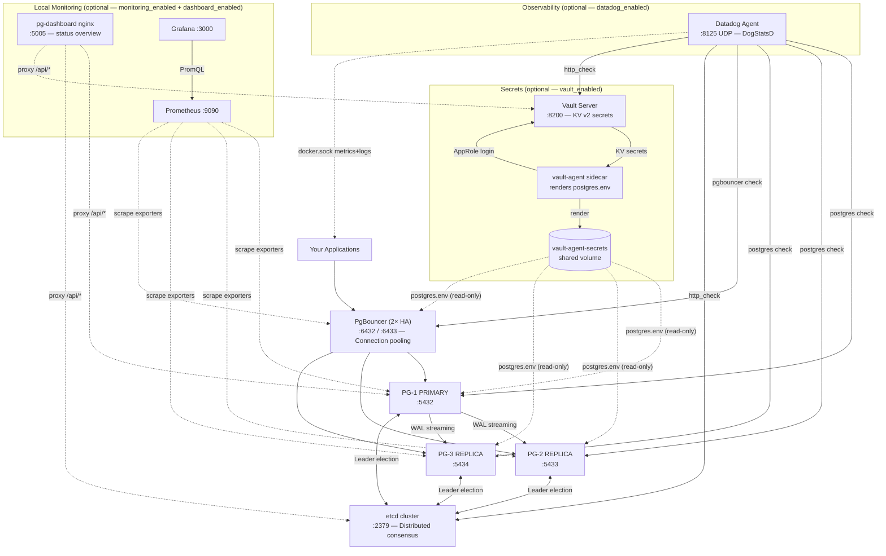

# 📖 New User Guide — Complete Overview

Welcome! This guide gives you a complete understanding of your PostgreSQL HA infrastructure.

## What You Have

You've deployed a **production-ready PostgreSQL HA cluster** with high availability, automatic failover, and connection pooling. Here's the architecture:


```mermaid
graph TD
    APP["Your Applications"]
    PGB["PgBouncer (2× HA)<br/>:6432 / :6433 — Connection pooling"]
    PG1["PG-1 PRIMARY<br/>:5432"]
    PG2["PG-2 REPLICA<br/>:5433"]
    PG3["PG-3 REPLICA<br/>:5434"]
    ETCD["etcd cluster<br/>:2379 — Distributed consensus"]

    subgraph SECRETS["Secrets (optional — vault_enabled)"]
        VAULT["Vault Server<br/>:8200 — KV v2 secrets"]
        AGENT["vault-agent sidecar<br/>renders postgres.env"]
        SVOL[("vault-agent-secrets\nshared volume")]
    end

    subgraph OBS["Observability (optional — datadog_enabled)"]
        DD["Datadog Agent<br/>:8125 UDP — DogStatsD"]
    end

    subgraph MON["Local Monitoring (optional — monitoring_enabled + dashboard_enabled)"]
        DASH["pg-dashboard nginx<br/>:5005 — status overview"]
        PROM["Prometheus :9090"]
        GRAF["Grafana :3000"]
    end

    APP --> PGB
    PGB --> PG1 & PG2 & PG3
    PG1 -->|"WAL streaming"| PG2 & PG3
    PG1 & PG2 & PG3 <-->|"Leader election"| ETCD
    AGENT -->|"AppRole login"| VAULT
    VAULT -->|"KV secrets"| AGENT
    AGENT -->|"render"| SVOL
    SVOL -. "postgres.env (read-only)" .-> PG1 & PG2 & PG3
    SVOL -. "postgres.env (read-only)" .-> PGB
    DD -->|"postgres check"| PG1 & PG2 & PG3
    DD -->|"pgbouncer check"| PGB
    DD -->|"http_check"| ETCD & VAULT
    DD -. "docker.sock metrics+logs" .-> APP
    PROM -. "scrape exporters" .-> PG1 & PG2 & PG3
    PROM -. "scrape exporters" .-> PGB
    GRAF -->|"PromQL"| PROM
    DASH -. "proxy /api/*" .-> PG1 & ETCD & VAULT
```

## Inside This Cluster

### 🐘 PostgreSQL (3 Nodes)

- **Version**: PostgreSQL 18.2
- **Replication**: Synchronous streaming (no data loss)
- **Extensions**: pgvector (AI/ML), uuid-ossp, pg_stat_statements
- **HA Features**: Automatic failover in < 30 seconds
- **Ports**: 5432–5434 (one per node)

### ⚙️ Patroni

- **Role**: Cluster orchestration and management
- **Function**: Elects leader, manages replicas, handles failover
- **API**: REST endpoints for monitoring (ports 8008–8010)

### 🔀 PgBouncer

- **Role**: Connection pooling proxy
- **Instances**: 2 (for high availability)
- **Pool Mode**: Transaction-level (default)
- **Ports**: 6432, 6433
- **Benefits**: Handles 1000s of concurrent connections with just ~100 backend connections

### 💾 etcd

- **Role**: Distributed configuration store
- **Function**: Stores cluster state, leader election
- **Ports**: 2379–2380

### 🌐 DBHub (Bytebase)

- **Role**: Web-based database management UI
- **Access**: http://localhost:9080
- **Features**: Query execution, schema browser, migrations

### 🔐 Vault (Secrets Management)

- **Version**: HashiCorp Vault 1.17.3
- **Role**: Centralized secrets manager for all PostgreSQL credentials
- **Backend**: Raft (embedded single-node, production mode)
- **Auth method**: AppRole (role_id + secret_id — no long-lived tokens)
- **Secrets engine**: KV v2 — versioned secrets at `secret/data/pg/postgres` and `secret/data/pg/replication`
- **Port**: 8200
- **Optional**: Toggle with `vault_enabled = true` in `ha-test.tfvars`

### 🤖 vault-agent (Secrets Sidecar)

- **Role**: Authenticates with Vault via AppRole, renders secrets to a shared Docker volume
- **Output file**: `/etc/vault/secrets/postgres.env` — mounted read-only into all pg-node and pgbouncer containers
- **Benefit**: Containers never hold credentials in their images or environment variables; secrets rotate without container rebuilds

### 📈 Local Monitoring Stack (Prometheus + Grafana)

- **Toggle**: `monitoring_enabled = true` + `dashboard_enabled = true` in `ha-test.tfvars` (both on by default in `ha-test.tfvars`)
- **nginx dashboard**: `http://localhost:5005` — single-page dark-themed cluster overview; polls Patroni, etcd, Vault, and Datadog APIs live every 10 s
- **Prometheus**: `http://localhost:9090` — scrapes `postgres-exporter-{1,2,3}` and `pgbouncer-exporter-{1,2}`; 15-day retention
- **Grafana**: `http://localhost:3000` (admin / admin) — two pre-provisioned dashboards:
  - **PostgreSQL Cluster** (`pg-ha-postgres`) — node status × 3, active connections, DB size, cache hit ratio, transaction rate, locks, checkpoint rate
  - **PgBouncer Pool** (`pg-ha-pgbouncer`) — active/waiting clients, server pool, query rate, max wait time
- **Health check**: `bash monitoring-health-check.sh` — 7-section report; flags `--targets`, `--metrics`, `--dashboard` for focused checks
- **Config files**: Prometheus config rendered at `terraform apply` time into `monitoring/rendered/` (gitignored)

### 📊 Datadog Agent (Observability)

- **Toggle**: `datadog_enabled = true` in `ha-test.tfvars` (off by default)
- **API key**: Pass via `export TF_VAR_datadog_api_key="<key>"` — never commit to tfvars
- **Port**: 8125 UDP (DogStatsD — custom metrics ingestion from other containers)
- **Integrations enabled automatically**:
  - `postgres` check — connects to all 3 Patroni nodes; collects connections, query stats, replication lag
  - `pgbouncer` check — both PgBouncer instances; pool utilisation, wait times, client/server counts
  - `http_check` — Patroni `/liveness` (3 nodes), etcd `/health`, Vault `/v1/sys/health`
  - `docker` auto-discovery — CPU, memory, I/O for every container via Docker socket
  - Log collection — all container stdout/stderr shipped to Datadog
- **Health check**: `bash datadog-health-check.sh` — 9-section report covering container, API key, integration checks, reachability, and agent errors
- **Config files**: Rendered at `terraform apply` time into `datadog/rendered/` (gitignored — contain passwords)

## Key Capabilities

### ✅ High Availability

- **Automatic Failover**: If primary fails, a replica becomes primary in < 30 sec
- **No Single Point of Failure**: etcd provides distributed consensus (3-way vote)
- **Replication**: Data synced to replicas continuously

### ✅ Connection Pooling

- **Reduce Overhead**: PgBouncer reuses connections (vs creating new ones)
- **Support Scaling**: Handle thousands of client connections with fewer backend connections
- **Admin Console**: Monitor pools, connections, statistics in real-time

### ✅ Observability

- **Cluster API**: REST endpoints show real-time cluster status
- **Web UI**: Visual database management at `http://localhost:9080`
- **Logs**: All container logs available via `docker logs`
- **nginx status dashboard** (optional): Live cluster overview at `http://localhost:5005` — enable with `dashboard_enabled = true`
- **Prometheus + Grafana** (optional): Full metrics dashboards at `http://localhost:3000` — enable with `monitoring_enabled = true`; verify with `bash monitoring-health-check.sh`
- **Datadog Agent** (optional): Full metrics pipeline — PostgreSQL, PgBouncer, Patroni, etcd, Vault, container-level telemetry. Enable with `datadog_enabled = true` and verify with `bash datadog-health-check.sh`

### ✅ Production Ready

- **Tested**: 35/35 assertions across 12 tests passed
- **Documented**: Comprehensive guides for every operation
- **Monitored**: Health checks, admin console, log aggregation

## Common Scenarios

### Scenario 1: I Want to Query the Database

**Get your password first:**

```bash
terraform output generated_passwords
```

**Option A: Via PgBouncer (Recommended)**

```bash
# Method 1: Environment variable
export PGPASSWORD='<password from generated_passwords>'
psql -h localhost -p 6432 -U pgadmin -d postgres
unset PGPASSWORD

# Method 2: Interactive password prompt
psql -h localhost -p 6432 -U pgadmin -d postgres -W

# Method 3: Connection string
psql "postgresql://pgadmin:<password from generated_passwords>@localhost:6432/postgres"
```

**Option B: Direct to Primary**

```bash
export PGPASSWORD='<password from generated_passwords>'
psql -h localhost -p 5432 -U pgadmin -d postgres
```

**Option C: Direct to Replica (Read-Only)**

```bash
export PGPASSWORD='<password from generated_passwords>'
psql -h localhost -p 5433 -U pgadmin -d postgres  # Replica 1
psql -h localhost -p 5434 -U pgadmin -d postgres  # Replica 2
```

**Recommendation**: Use PgBouncer (Option A) for all applications. See [PgBouncer Authentication](../pgbouncer/AUTHENTICATION.md) for detailed password handling options.

### Scenario 2: The Primary Failed — What Happens?

1. **Failure Detected** (within 30 seconds)
   - Patroni notices pg-node-1 is unresponsive
   - etcd records the failure

2. **Election Happens** (within 1 second)
   - etcd votes on next leader
   - pg-node-2 or pg-node-3 becomes primary

3. **Your App Reconnects** (transparent)
   - PgBouncer detects new primary
   - Connections redirect automatically
   - Most applications see no interruption

**Test this yourself:**

```bash
docker stop pg-node-1          # Simulate failure
sleep 30
curl http://localhost:8008/leader  # Check new leader
docker start pg-node-1         # Heal
```

### Scenario 3: I Want to Monitor Cluster Health

**Quick Health Check:**

```bash
# Check if all nodes are running
docker ps | grep -E 'pg-node|pgbouncer|etcd'

# Check primary/replica status
curl -s http://localhost:8008/cluster | python3 -m json.tool | grep '"role"\|"state"'

# Check replica lag
curl -s http://localhost:8008/replica | python3 -m json.tool | grep lag
```

**Via PgBouncer Admin:**

```bash
PGPASSWORD='<password from generated_passwords>' psql -h localhost -p 6432 -U pgadmin -d pgbouncer
pgbouncer> SHOW POOLS;      # Connection pool status
pgbouncer> SHOW STATS;      # Detailed statistics
pgbouncer> SHOW CLIENTS;    # Active clients
```

### Scenario 4: I Want to Check Vault Secrets

```bash
# 1. Check Vault health
curl -s http://localhost:8200/v1/sys/health | python3 -c "
import sys, json; d = json.load(sys.stdin)
print('initialized:', d['initialized'])
print('sealed:     ', d['sealed'])
print('version:    ', d['version'])
"

# 2. Verify bootstrap artifacts exist
ls -la .vault-bootstrap/vault-init.json .vault-bootstrap/role_id .vault-bootstrap/secret_id

# 3. Read a KV secret (requires root token)
VAULT_TOKEN=$(jq -r '.root_token' .vault-bootstrap/vault-init.json)
curl -sf -H "X-Vault-Token: $VAULT_TOKEN" \
  http://localhost:8200/v1/secret/data/pg/postgres | python3 -c "
import sys, json
d = json.load(sys.stdin)['data']['data']
print('postgres_user:    ', d['postgres_user'])
print('password set:     ', len(d['postgres_password']) > 0)
"

# 4. Test AppRole authentication (machine-to-machine flow)
ROLE_ID=$(cat .vault-bootstrap/role_id)
SECRET_ID=$(cat .vault-bootstrap/secret_id)
curl -sf -X POST \
  -d "{\"role_id\":\"$ROLE_ID\",\"secret_id\":\"$SECRET_ID\"}" \
  http://localhost:8200/v1/auth/approle/login | python3 -c "
import sys, json; d = json.load(sys.stdin)
print('token acquired:', len(d['auth']['client_token']) > 0)
"

# 5. Verify vault-agent rendered secrets in all containers
for c in pg-node-1 pg-node-2 pg-node-3 pgbouncer-1 pgbouncer-2; do
  echo -n "$c: "
  docker exec "$c" sh -c 'test -f /etc/vault/secrets/postgres.env && echo OK || echo MISSING'
done
```

### Scenario 5: I Want to Use the Local Monitoring Stack

The local monitoring stack is enabled by default (`monitoring_enabled = true`, `dashboard_enabled = true` in `ha-test.tfvars`).

```bash
# Run full 7-section health report
bash monitoring-health-check.sh

# Focused checks
bash monitoring-health-check.sh --targets    # Prometheus scrape targets
bash monitoring-health-check.sh --metrics    # pg_up per node
bash monitoring-health-check.sh --dashboard  # nginx proxy endpoints

# Access the UIs
open http://localhost:5005   # nginx cluster status dashboard
open http://localhost:3000   # Grafana (admin / admin)
open http://localhost:9090   # Prometheus UI
```

**Expected output from `bash monitoring-health-check.sh`:**

```text
── 1. Container Status ──────  ✓ postgres-exporter-1/2/3  running
                                ✓ prometheus               running
                                ✓ grafana                  running
── 2. Prometheus Targets ────  ✓ All 6 targets healthy
── 3. PostgreSQL pg_up ──────  ✓ pg-node-1/2/3  UP
── 4. PgBouncer Metrics ─────  ✓ 2 pool instances reporting
── 5. Grafana Dashboards ────  ✓ PostgreSQL Cluster provisioned
                                ✓ PgBouncer Pool provisioned
── 6. nginx Dashboard Proxy ─  ✓ / → HTTP 200
                                ✓ /api/cluster → HTTP 200
── 7. Exporter Errors ───────  ✓ no errors
── Summary ──────────────────  All checks passed.
```

To disable the stack: set `monitoring_enabled = false` and `dashboard_enabled = false` in `ha-test.tfvars` and re-apply.

### Scenario 6: I Want to Monitor with Datadog

**Prerequisites**: `datadog_enabled = true` in `ha-test.tfvars` and API key set.

```bash
# 1. Full 9-section health report
bash datadog-health-check.sh

# 2. Compact agent status
bash datadog-health-check.sh --status

# 3. Integration check results only
bash datadog-health-check.sh --checks

# 4. Re-run individual integration checks
docker exec datadog-agent agent check postgres    # PostgreSQL metrics (all 3 nodes)
docker exec datadog-agent agent check pgbouncer   # PgBouncer pool metrics
docker exec datadog-agent agent check http_check  # Patroni + etcd + Vault liveness

# 5. Full agent status (verbose)
docker exec datadog-agent agent status

# 6. Tail agent logs
docker logs datadog-agent -f
```

**Expected output from `bash datadog-health-check.sh`:**

```text
── 1. Container Status ──  ✓ datadog-agent is running (Up X minutes (healthy))
── 2. Agent Connectivity ── ✓ API key validated
── 3. Integration Checks ── ✓ PostgreSQL — metrics collected
                            ✓ PgBouncer  — metrics collected
                            ✓ HTTP checks — metrics collected
── 4. Patroni REST API ──── ✓ pg-node-1:8008/liveness → 200
                            ✓ pg-node-2:8008/liveness → 200
                            ✓ pg-node-3:8008/liveness → 200
── 5–6. PostgreSQL/PgBouncer TCP ── ✓ all nodes reachable
── 7. etcd Health ───────── ✓ etcd:2379/health → 200
── 8. Vault Health ──────── ✓ vault:8200/v1/sys/health → 200
── 9. Recent Agent Errors ─ ✓ No actionable errors
```

### Scenario 6: I Want to Add More Data

```bash
# Create table
PGPASSWORD='<password from generated_passwords>' psql -h localhost -p 6432 -U pgadmin -d postgres << 'EOF'
CREATE TABLE my_table (
  id SERIAL PRIMARY KEY,
  name TEXT NOT NULL,
  created_at TIMESTAMP DEFAULT NOW()
);
EOF

# Insert data
PGPASSWORD='<password from generated_passwords>' psql -h localhost -p 6432 -U pgadmin -d postgres << 'EOF'
INSERT INTO my_table (name) VALUES ('Alice'), ('Bob'), ('Charlie');
SELECT * FROM my_table;
EOF

# Verify on replica (read-only)
PGPASSWORD='<password from generated_passwords>' psql -h localhost -p 5433 -U pgadmin -d postgres -c "SELECT * FROM my_table;"
```

## Important Ports

| Port | Service | Purpose | Access |
| ---- | ------- | ------- | ------ |
| 6432 | PgBouncer-1 | Connection pooling | Your apps here ✅ |
| 6433 | PgBouncer-2 | Connection pooling | Failover |
| 5432 | PostgreSQL-1 | Primary DB | Direct access |
| 5433 | PostgreSQL-2 | Replica DB | Read-only |
| 5434 | PostgreSQL-3 | Replica DB | Read-only |
| 8008 | Patroni-1 | Cluster API | Monitoring |
| 8009 | Patroni-2 | Cluster API | Monitoring |
| 8010 | Patroni-3 | Cluster API | Monitoring |
| 2379 | etcd | Configuration | Internal |
| 8200 | Vault | Secrets API & UI | Optional (`vault_enabled`) |
| 8125/udp | Datadog Agent | DogStatsD custom metrics | Optional (`datadog_enabled`) |
| 9080 | DBHub | Web UI | Browser |
| 5005 | pg-dashboard | nginx cluster status | Optional (`dashboard_enabled`) |
| 9090 | Prometheus | Metrics scrape & query | Optional (`monitoring_enabled`) |
| 3000 | Grafana | Pre-provisioned dashboards | Optional (`monitoring_enabled`) |

## File Organization

```text
Your project:
├── README.md                    ← Main overview
├── docs/                        ← All documentation
├── main-ha.tf                   ← Core infrastructure (Terraform)
├── main-vault.tf                ← Vault container + volume (Terraform)
├── main-vault-agent.tf          ← vault-agent sidecar (Terraform)
├── main-vault-init.tf           ← Vault bootstrap trigger (Terraform)
├── main-datadog.tf              ← Datadog Agent container + rendered configs
├── main-dashboard.tf            ← nginx status dashboard container (pg-dashboard)
├── main-monitoring.tf           ← Prometheus + Grafana + exporter containers
├── variables-ha.tf              ← All configuration knobs
├── outputs-ha.tf                ← Connection strings & endpoints
├── ha-test.tfvars               ← Your deployment values
├── datadog-health-check.sh      ← 9-section Datadog health report
├── monitoring-health-check.sh   ← 7-section Prometheus + Grafana + nginx health report
├── datadog/conf.d/              ← Integration config templates (postgres, pgbouncer, http_check)
├── datadog/rendered/            ← Rendered configs with passwords (gitignored)
├── dashboard/                   ← nginx status dashboard (index.html + nginx.conf.tpl)
├── dashboard/rendered/          ← Rendered nginx.conf (gitignored)
├── monitoring/prometheus/       ← Prometheus scrape config template (prometheus.yml.tpl)
├── monitoring/rendered/         ← Rendered prometheus.yml (gitignored)
└── monitoring/grafana/provisioning/  ← Grafana auto-provisioned datasource + dashboards
├── vault/config/vault.hcl       ← Vault server config (Raft backend)
├── vault-bootstrap.sh           ← Init, unseal, AppRole + KV seed
├── vault-secrets.sh             ← Shared Vault HTTP library (sourced by entrypoints)
├── .vault-bootstrap/            ← Bootstrap artifacts (gitignored)
│   ├── vault-init.json         ← Root token + unseal keys
│   ├── role_id                 ← AppRole role ID
│   └── secret_id               ← AppRole secret ID
├── pgbouncer/                   ← PgBouncer configs
│   ├── pgbouncer.ini           ← Main config
│   └── userlist.txt            ← Credentials (generated at apply)
├── patroni/                     ← Patroni node configs
│   └── rendered/               ← Generated at terraform apply (gitignored)
└── liquibase/changelog/         ← Schema migrations
```

## Security Considerations

### Current Setup

- **PostgreSQL User**: `pgadmin`
- **Password**: Auto-generated by Terraform — retrieve with `terraform output generated_passwords`
- **Auth method**: SCRAM-SHA-256 (no plain-text passwords in transit)
- **Secrets**: When `vault_enabled = true`, all passwords stored in Vault KV v2; injected at container startup via vault-agent
- **AppRole**: Vault uses role_id + secret_id (no long-lived root tokens passed to containers)
- **Network**: Docker bridge (isolated, not exposed externally by default)

### Before Production ⚠️

- [ ] Review and tighten port exposure in `ha-test.tfvars`
- [ ] Enable SSL/TLS for remote connections
- [ ] Restrict network access to authorized users only
- [ ] Enable PostgreSQL audit logging (`pgaudit`)
- [ ] Configure automated backups
- [ ] Enable `vault_enabled = true` and rotate AppRole `secret_id` regularly
- [ ] Enable `datadog_enabled = true` and set a real API key via `TF_VAR_datadog_api_key`
- [ ] Review the Security Boundaries section in [Architecture Overview](../architecture/ARCHITECTURE.md)

## Development vs Production

### Development Setup (Current)

- ✅ Quick local deployment
- ✅ Easy testing and debugging
- ✅ Auto-generated credentials
- ⚠️ Not suitable for sensitive data without further hardening

### Production Setup

- 🔒 Enable SSL/TLS
- 🔒 Restrict port exposure with firewall rules
- 🔒 Enable PostgreSQL audit logging
- 🔒 Set up automated backups
- 🔒 Configure monitoring and alerts
- 🔒 Enable Vault (`vault_enabled = true`) — see [Vault Quick Start](VAULT-QuickStart.md)
- 🔒 Rotate Vault AppRole `secret_id` on a schedule
- 🔒 Restrict Vault port 8200 to internal network only
- 🔒 Enable Datadog (`datadog_enabled = true`) with a real API key for production monitoring

## Your Next Steps (Choose One)

### Option 1: Just Want to Use It

→ See [Quick Start](01-QUICK-START.md) section "Common Next Steps"

### Option 2: Want to Understand It Better

→ Read [Architecture Overview](../architecture/ARCHITECTURE.md)

### Option 3: Need to Operate It

→ Review [Operations & Maintenance](../guides/02-OPERATIONS.md)

### Option 4: Want to Configure It

→ Edit `ha-test.tfvars` and review `variables-ha.tf` for all available knobs

### Option 5: Something's Wrong

→ Check [Troubleshooting](../guides/03-TROUBLESHOOTING.md)

## Quick Commands Reference

```bash
# Get generated passwords
terraform output generated_passwords

# View cluster status
curl -s http://localhost:8008/cluster | python3 -m json.tool

# Check PgBouncer pools
PGPASSWORD='<password from generated_passwords>' psql -h localhost -p 6432 -U pgadmin -d pgbouncer -c "SHOW POOLS;"

# View container logs
docker logs pg-node-1 -f
docker logs pgbouncer-1 -f
docker logs etcd -f
docker logs vault -f
docker logs vault-agent -f

# Test connections
export PGPASSWORD='<password from generated_passwords>'
psql -h localhost -p 6432 -U pgadmin -d postgres -c "SELECT 1;"
psql -h localhost -p 5432 -U pgadmin -d postgres -c "SELECT 1;"
unset PGPASSWORD

# Vault — check health
curl -s http://localhost:8200/v1/sys/health | python3 -m json.tool

# Vault — verify secrets rendered into containers
for c in pg-node-1 pg-node-2 pg-node-3 pgbouncer-1 pgbouncer-2; do
  echo -n "$c: "; docker exec "$c" sh -c 'test -f /etc/vault/secrets/postgres.env && echo OK || echo MISSING'
done

# Vault — read a KV secret
VAULT_TOKEN=$(jq -r '.root_token' .vault-bootstrap/vault-init.json)
curl -sf -H "X-Vault-Token: $VAULT_TOKEN" http://localhost:8200/v1/secret/data/pg/postgres | python3 -m json.tool

# Datadog — full health report (requires datadog_enabled = true)
bash datadog-health-check.sh

# Datadog — re-run individual integration checks
docker exec datadog-agent agent check postgres
docker exec datadog-agent agent check pgbouncer
docker exec datadog-agent agent check http_check

# Local monitoring — full health report
bash monitoring-health-check.sh

# Local monitoring — open UIs
open http://localhost:5005   # nginx status dashboard
open http://localhost:3000   # Grafana (admin / admin)
open http://localhost:9090   # Prometheus
```

## Terminology

| Term | Meaning |
| ---- | ------- |
| **HA** | High Availability (survives component failures) |
| **Failover** | Automatic promotion of replica to primary |
| **Replica** | Read-only copy of primary database |
| **Replication** | Continuous sync of data from primary to replicas |
| **Patroni** | Orchestration layer managing PostgreSQL cluster |
| **etcd** | Distributed configuration and leader election service |
| **PgBouncer** | Connection pooling proxy (your apps connect here) |
| **Pool** | Set of reusable connections to avoid creating new ones |
| **Transaction Mode** | PgBouncer allocates a connection per transaction (most compatible) |
| **Vault** | HashiCorp Vault — centralized secrets manager; stores DB passwords in KV v2 |
| **vault-agent** | Sidecar container that authenticates with Vault and injects secrets into pg-node/pgbouncer containers |
| **AppRole** | Vault auth method using role_id + secret_id pair (machine-to-machine authentication) |
| **KV v2** | Vault Key-Value secrets engine v2 — versioned secret store |
| **Datadog Agent** | Container-based observability agent; collects PostgreSQL, PgBouncer, Patroni, etcd, and Vault metrics |
| **DogStatsD** | UDP protocol (port 8125) for pushing custom application metrics into Datadog |
| **Integration check** | Datadog built-in check (postgres, pgbouncer, http_check) that scrapes metrics from a specific service |
| **Prometheus** | Open-source metrics store that scrapes exporters on a schedule; queryable via PromQL |
| **postgres_exporter** | Sidecar container that connects to a PostgreSQL node and exposes metrics in Prometheus format |
| **pgbouncer_exporter** | Sidecar container that queries the PgBouncer admin console and exposes pool metrics |
| **Grafana** | Dashboard UI that queries Prometheus via PromQL and renders pre-provisioned dashboards |
| **pg-dashboard** | nginx container serving a single-page cluster status app; proxies Patroni/etcd/Vault APIs |

## Frequently Asked Questions

**Q: Can I connect directly to the database?**
A: Yes — either via PgBouncer (:6432) or directly (:5432). PgBouncer is recommended for applications.

**Q: What happens if a node crashes?**
A: Failover happens automatically. A replica becomes primary within < 30 seconds. Your apps keep running (brief reconnect needed).

**Q: Can I make backups?**
A: Yes! Use `pg_dump` or configure continuous archiving (see [Operations](../guides/02-OPERATIONS.md)).

**Q: Can I run other databases?**
A: This is PostgreSQL only. You can create multiple databases on the cluster though.

**Q: Is this secure?**
A: Suitable for development as-is. For production, harden using the checklist in the Security section above.

**Q: Where are the database passwords stored?**
A: When `vault_enabled = true`, passwords are stored in Vault KV v2 (`secret/data/pg/postgres`, `secret/data/pg/replication`). vault-agent renders them to `/etc/vault/secrets/postgres.env` at container startup. Without Vault, passwords come from Terraform-generated environment variables.

**Q: How do I retrieve a secret from Vault?**
A:

```bash
VAULT_TOKEN=$(jq -r '.root_token' .vault-bootstrap/vault-init.json)
curl -sf -H "X-Vault-Token: $VAULT_TOKEN" \
  http://localhost:8200/v1/secret/data/pg/postgres | python3 -m json.tool
```

**Q: What if Vault restarts?**
A: Vault auto-unseals on the first deploy. After a restart you need to unseal it manually:

```bash
docker exec vault vault operator unseal \
  $(jq -r '.unseal_keys_b64[0]' .vault-bootstrap/vault-init.json)
```

Containers already running keep their rendered `postgres.env` until the next restart.

**Q: What if I need to scale?**
A: Edit `ha-test.tfvars` (pool sizes, replica count) and review `variables-ha.tf` for all tuning options.

---

## Ready to Go?

1. **[Jump to Quick Start](01-QUICK-START.md)** — Deploy it now (5 min)
2. **[Read Architecture](../architecture/ARCHITECTURE.md)** — Learn how it works (15 min)

Then check out [docs/README.md](../README.md) for the full documentation map.

**Status**: ✅ Your cluster is running and ready to use!
